# Exploring `Agents` in Model HQ
Once you complete the initial setup, you will be directed to the **Main Menu**.  
This interface provides access to a range of functionalities. In this section, we will focus specifically on the **Agent** feature.

&nbsp;

## 1. Launching the Agent Interface
To begin, click on the **Agent** button from the main menu.

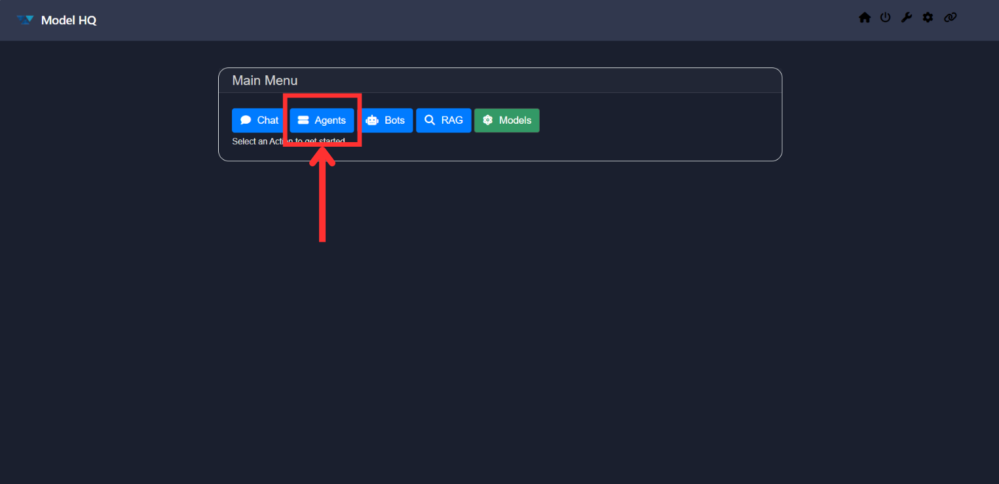

&nbsp;

## 2. Understanding the Agent Menu
Upon entering the Agent interface, you will be presented with a variety of options.

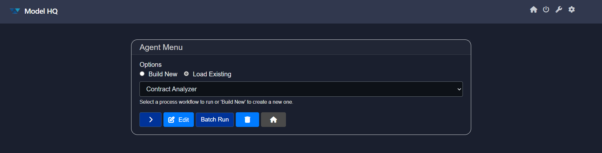

Here is a breakdown of the key components:

1. **Options**:
   - **Build New**: Create a new agent from scratch.
   - **Load Existing**: Load an existing agent, either a pre-created template included in Model HA or previously built by you.

2. **Dropdown**: Displays all available agents, including both pre-created and user-created agents.

3. **`>` (Next)**: Proceeds with the selected agent or action.

4. **Edit**: Modify or delete an existing agent.

5. **Batch Run**: Upload files that will be treated as separate input work items and passed one-by-one into the process.

6. **🗑️**: Delete an existing agent from the dropdown list.

7. **Home**: Return to the main menu.

&nbsp;

For the purpose of this documentation, we will use the **`Load Existing`** option to explore the Agent workflow.
## Available Pre-Created Agents in Model HQ:
- **Contract Analyzer**
- **Customer Support**
- **Financial Data Extractor**
- **Image Tagger**
- **Intake Processing**
- **Research Process**

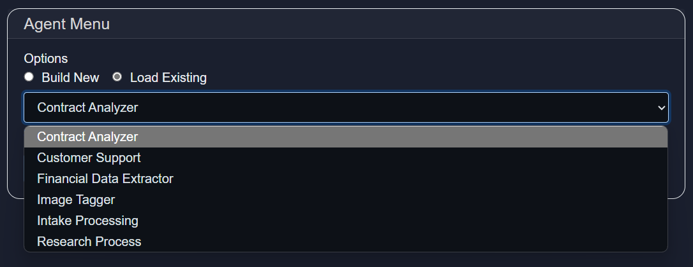

Select any agent from the list and click the `>` button to continue.  
For this walkthrough, we have selected **Contract Analyzer** which was specifically designed to demonstrate how complext Employment Agreements can be quickly queried using pre-built agents. The Contract Analyzer (Detailed information about this Agent workflow can also be found in LLMWare's YouTube channel- https://youtu.be/FSjpAgIZnPM?si=6UMkLD4HMdXxmxcg)

&nbsp;

## 3. Confirming the Agent
After selection, you will be presented with a confirmation screen summarizing the chosen agent along with a detailed description.

Each agent includes a summary of the processes it will perform. Click the **Details** button to review these processes.

If the selected agent requires changes, click **Exit**, return to the previous menu, and use the **Edit** button to modify the configuration.  
*(Documentation for editing agents is available separately.)*

If everything looks good, proceed by clicking the **RUN** button.

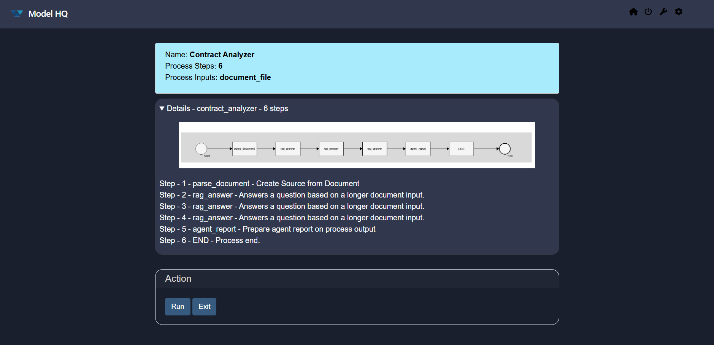

&nbsp;

## 4. Uploading an Input File
In this step, upload the file that the agent will process. Model HQ includes sample executive employment agreements documents for you to try for this test agent use case in **c:\users\{user name}\llmware_data\sample_files\agreements**. This sample agent is designed to show how you can query documents using pre-built agents in an automated workflow. 

(The supported file types are `.pdf`, `.pptx`, `.docx`, `.txt`, and `.md`.)

This screen is straightforward—simply upload an example file from the file path above and click the `>` button to proceed.

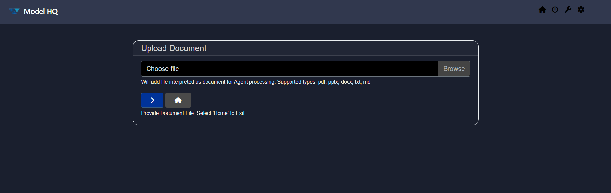

&nbsp;

## 5. Receiving the Output
Once the file is uploaded, the agent will begin executing the defined workflow automatically.  
No further user action is required at this stage.

The agent will process the input and generate the output as defined in its configuration.

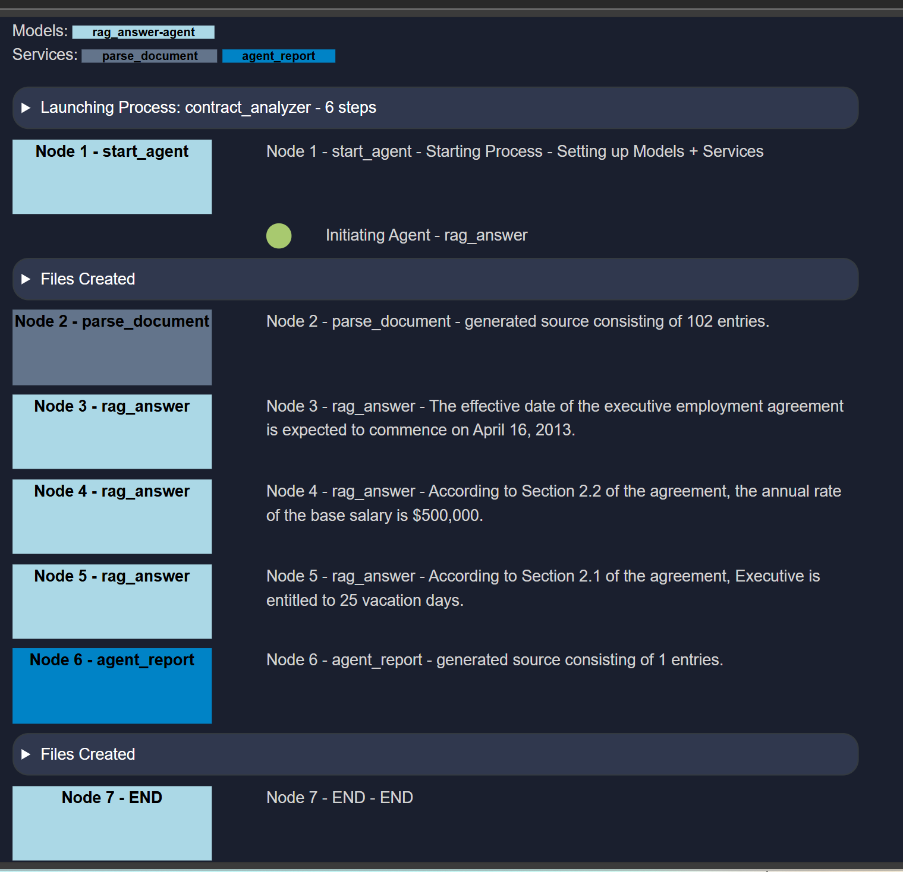

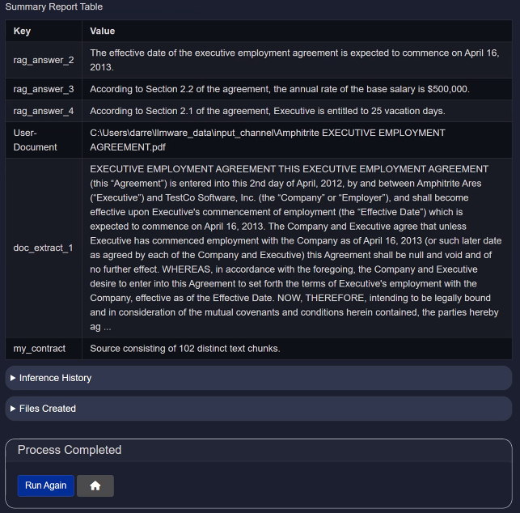

&nbsp;

## 6. Inference History
The Inference History table provides detailed logs of each inference performed by the language model, allowing for transparency, performance tracking, and auditing. This is particularly useful for AI-driven contract analysis, customer support, research process, etc.

| **Column**            | **Description**                                                                 |
| --------------------- | ------------------------------------------------------------------------------- |
| **inference**         | A sequential identifier for each inference operation.                           |
| **llm\_response**     | The text response generated by the language model (LLM) based on input context. |
| **confidence\_score** | The model's confidence level (if available). `NA` indicates not applicable.     |
| **tokens**            | Shows token statistics, including input, output, and total tokens processed.    |
| **first token**       | Time (in seconds) taken to generate the first token of the response.            |
| **processing time**   | Total time (in seconds) taken to process and return the complete response.      |

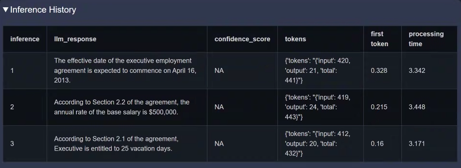

&nbsp;

## 7. Files Created
This section lists the output files generated by a specific **Contract Analyzer Agent**. Each file captures a distinct part of the analysis—ranging from visual diagrams to raw metadata and final summaries—making it easier to trace the agent's behavior and audit the results.

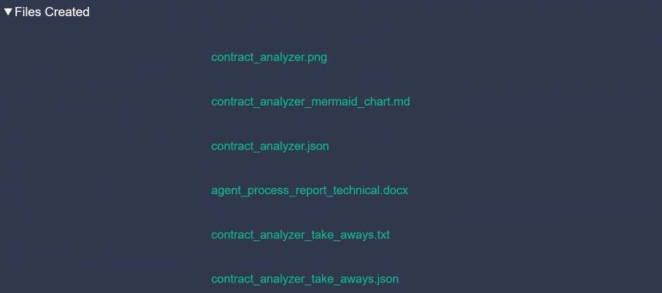

| **File Name**                         | **Description**                                                                                       |
| ------------------------------------- | ----------------------------------------------------------------------------------------------------- |
| `agent_name.png`               | A visual representation (e.g., diagram or flowchart) of the contract analysis process or structure.   |
| `agent_name_mermaid_chart.md`  | A markdown file containing a Mermaid.js chart definition that visually maps the agent’s workflow.     |
| `agent_name.json`              | A structured JSON file containing the raw data or metadata extracted by the agent from the contract.  |
| `agent_process_report_technical.docx` | A detailed technical report describing the internal processing steps, models used, and outcomes.      |
| `agent_name_take_aways.txt`    | A human-readable text summary highlighting the key insights and findings from the contract.           |
| `agent_name_take_aways.json`   | A structured version of the takeaways in JSON format for use in APIs, dashboards, or further parsing. |

> [!Important]
> In the screenshots above and below, you'll notice the name `contract_analyzer` being used (as mentioned before). This is because these outputs were generated while testing the Contract Analyzer Agent.

### contract_analyzer.png
A graphical image that provides a visual representation of the contract analysis process or its extracted structure. It might include hierarchical clause trees, entity relationships, or summary visualizations.
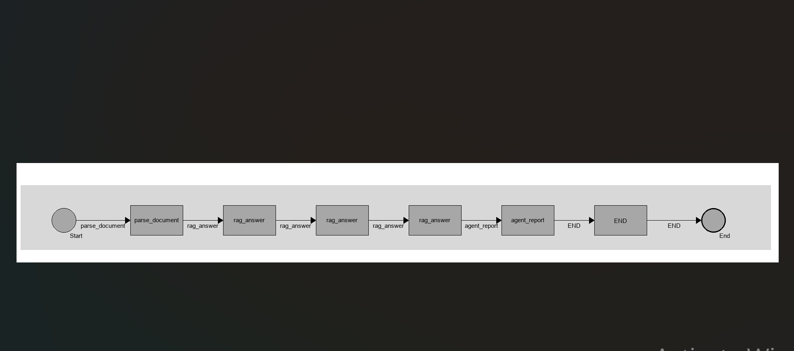

### contract_analyzer_mermaid_chart.md
A Markdown file that contains a Mermaid.js diagram definition. This chart helps visually explain the logic, flow, or state transitions followed by the agent during contract analysis.

It looks like this:
```md
flowchart TD

A[start_agent] -->|start_agent - Starting Process - Setting up Models + Services|B[parse_document]
B[parse_document] -->|parse_document - parse_document|C[rag_answer]
C[rag_answer] -->|rag_answer - rag_answer|D[rag_answer]
D[rag_answer] -->|rag_answer - rag_answer|E[rag_answer]
E[rag_answer] -->|rag_answer - rag_answer|F[agent_report]
F[agent_report] -->|agent_report - agent_report|G[END]
```

### contract_analyzer.json
A structured JSON file containing the full set of metadata, entities, or extracted fields identified by the agent. This file is particularly useful for integrations or detailed audits.

```json
{
  "agent": {
    "process_name": "contract_analyzer",
    "display_name": "Contract Analyzer",
    "description": {},
    "node_wrappers": [
      "view_execution"
    ],
    "input_heads": [
      {
        "name": "AddDocumentInputHead",
        "kwargs": {
          "process_name": "contract_analyzer"
        }
      }
    ],
    "reranker_max_samples": 1000,
    "derive_from_process": "",
    "sql_model": "slim-sql-ov",
    "include_source_info": false,
    "rag_answer_model": "llama-3.2-3b-instruct-ov",
    "context_id_list": [
      {
        "context_id": "User-Document",
        "type": "document_file",
        "node": 0,
        "service": "AddDocumentInputHead",
        "value": "",
        "source": "input_head"
      },
      {
        "context_id": "my_contract",
        "type": "doc_source",
        "node": 1,
        "service": "parse_document",
        "value": "my_contract",
        "source": "process"
      },
      {
        "context_id": "my_contract",
        "type": "source",
        "node": 1,
        "service": "parse_document",
        "value": "my_contract",
        "source": "process"
      }
    ],
    "sub_process": null,
    "filter_large_doc_state": true,
    "chat_model": "llama-3.2-3b-instruct-ov",
    "install_agent_files": [],
    "global_named_vars_list": [
      {
        "key": "rag_answer_2",
        "value": "",
        "service": "rag_answer",
        "node": 2
      },
      {
        "key": "rag_answer_3",
        "value": "",
        "service": "rag_answer",
        "node": 3
      },
      {
        "key": "rag_answer_4",
        "value": "",
        "service": "rag_answer",
        "node": 4
      }
    ],
    "auto_optimize": true,
    "api_exec": false,
    "preload_models": true,
    "library_search_results": 20,
    "process_inputs": [
      [
        "User-Document",
        "document_file"
      ]
    ],
    "compare_or_aggregate_mode": "aggregate",
    "rag_compare_instruction": "Attached are several sources - please use as the basis for answering questions, and cite the specific source, if used, in generating your answer.\n",
    "chat_instruction": "",
    "max_output": 1000,
    "test_input": "",
    "api_key": null,
    "api_endpoint": {},
    "answer_model": "bling-tiny-llama-ov",
    "text_chunk_size": 600,
    "rag_aggregate_instruction": "",
    "wiki_article_count": 3,
    "context_target_size": 500,
    "context_top_n": 3
  },
  "controls": {
    "check_hash": true,
    "sensitive": [],
    "classifiers": [],
    "exclusion_list": [],
    "invisible_text": false
  },
  "report_configs": {
    "tech_report": {
      "format": "docx",
      "elements": [
        "report",
        "report_commentary",
        "research_list",
        "response_list",
        "safety_record",
        "usage_history",
        "inference_history"
      ]
    },
    "report_types": [
      "Technical"
    ],
    "take_aways": {},
    "compliance_report": {
      "format": "docx",
      "elements": [
        "report",
        "research_list",
        "response_list",
        "scratch_pad",
        "journal"
      ]
    },
    "business_report": {
      "format": "docx",
      "elements": [
        "report",
        "report_commentary"
      ]
    }
  },
  "process": {
    "node0": {
      "service": "parse_document",
      "inputs": {
        "doc_source_name": "my_contract",
        "fp": "{{User-Document}}"
      }
    },
    "node1": {
      "service": "rag_answer",
      "inputs": {
        "query": "When is the effective date of the executive employment agreement?",
        "doc_state": "{{my_contract}}"
      }
    },
    "node2": {
      "service": "rag_answer",
      "inputs": {
        "query": "What is the annual rate of the base salary?",
        "doc_state": "{{my_contract}}"
      }
    },
    "node3": {
      "service": "rag_answer",
      "inputs": {
        "query": "How many vacation day?",
        "doc_state": "{{my_contract}}"
      }
    },
    "node4": {
      "service": "agent_report",
      "inputs": {
        "title": "Contract Analysis Report"
      }
    },
    "node5": {
      "service": "END"
    }
  }
}
```

### agent_process_report_technical.docx
This is a technical report in Word format that documents the internal workings of the agent. It includes inference logic, model details, parameters used, and evaluation outcomes.

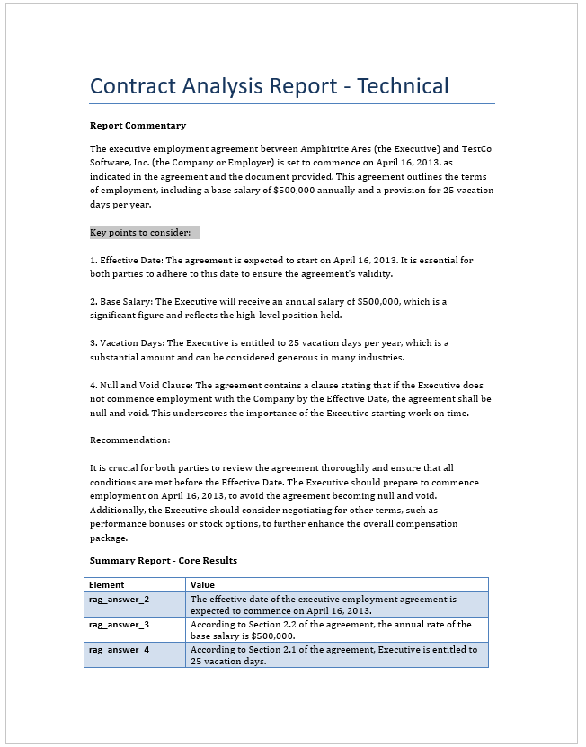

### contract_analyzer_take_aways.txt
A plain text summary containing the key findings from the contract. It includes every detail of the agent workflow in text format stating everything happened in a particular step.

Checkout here: https://github.com/RS-labhub/ModelHQ-Docs/blob/master/agent/contract_analyzer_take_aways.txt

### contract_analyzer_take_aways.json
A machine-readable version of the takeaways file. This JSON structure makes it easier to import the key insights that are generated by running this agent. It also contains the same information as of `contract_analyzer_take_aways.txt` but just in JSON format.

Checkout here: https://github.com/RS-labhub/ModelHQ-Docs/blob/master/agent/contract_analyzer_take_aways.json

&nbsp;
   
## 8. Exiting Agents
Once the Agent workflow is complete, scroll to the bottom of your screen to either 'Run Again' which will run the process again or click on '🛖' icon to exit and return to the Main Menu.

## Conclusion
This concludes the walkthrough of the **Agent** interface in Model HQ.  
In subsequent sections, we will explore how to build, edit and customize your own agents from scratch or run the workflow in batches (run multiple documents at once). Please go to the Creating New Agent, Edit Agent or Batch Run Sections of this documentation.

If you have any questions or feedback, please reach out to us at `support@aibloks.com`.
