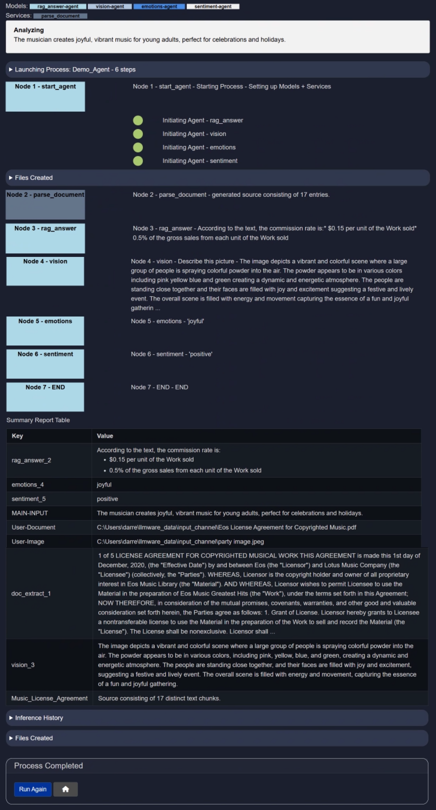

# Creating a New Agent
This guide provides a step-by-step walkthrough for creating a new agent using the platform. You will learn how to initiate a new agent, configure its properties, build its process logic, and finalize its setup. Whether you are building an agent from scratch or leveraging an existing workflow, this documentation will help you understand all available options and configurations.

 

## Agent Menu
To begin creating a new agent:

1. Navigate to the **Main Menu**.
2. Go to the **Agents** section.
3. Select the `Build New` option to initiate a new agent.


Click on `>` to proceed to the next step.

 

## Configure Agent
Click on **Start Building** to begin the agent development process.


 

## Agent Setup
In this section, you will define the foundational settings for your agent.


### Inputs
1. **Name the Agent** — Provide a unique and descriptive name for your agent.
2. **Define Inputs** — Specify the input types required from users to initiate the agent. This is a critical step as it is VERY IMPORTANT to **select the correct inputs that will be used** in the Agent process - the inputs may also be modified as you are creating the agent but you will always need to select the necessary inputs. By default, `MAIN-INPUT (text)` is set. 

  - `MAIN-INPUT (text)`: refers to a piece of text that will be typed or copied and pasted into the text field - the current limit is 5000 characters for this text field (approximately up to 2 pages of text).

  - `User-Document`: A larger document which must be PARSED first via the 'parse_document' service in the Agent 'Select Service' prior to being used in an agent workflow. **Important: A User Document must almost always be processed first via the 'parse_document' service**, which then breaks up the document text into smaller chunks, prior to being used for other Agent Services such as Rag_Answer, Semantic_Filter, Document_Filter or Create_Context.
     
  - `User-Table`: A user can upload a .CSV or JSON that the agent will attempt to interpret as a table with labelled columns and a consistent set of rows that it can label. **Important: A User Table must first be processed via 'build-table' service** prior to being used in an Agent process from the 'Select Service' dropdown. The Build Table service will attempt to extract relevant information and save the information in a local SQL database in Model HQ prior to using any table in an Agent process.

    The agent process must 
      1) upload a table, 
      2) 'Build_Table' from the Agent 'Select Service' dropdown (this service extracts all the information and attempts to build a database table from the information submitted), and 
      3) 'Query_Custom_Table' (this service expects an input context that is a table inference from the 'Build_Table' service) which allows a user to ask a simple natural language question from the Table.
     
  - `User-Image`: A user can upload an image file such as .PNG or .JPEG for image processing in an agent workflow. **Imporant: A User Image must first be processed via the 'vision' service** prior to being used in an Agent Prprocess from the 'Select Service' dropdown menu. The Vision service will take an image file along with a text input of a question or instruction, then returns a text output context with the answer based on the contents of the image.
     
  - `User-Text`: Designed to be a secondary piece of additional context that a user can provide in an Agent workflow.
     
  - `User-Source`: A User Source allows the user to upload a grouping of indefinite number of documents, images, etc. that can all be packaged as a source to be treated as one object. While most use cases have single or few inputs, this allows for more dynamic, flexible method of allowing for variable user input. If you select User Source, you do not need to go through the Parse_Document, Build_Table, or Vision services as these services will automatically be applied. **Imporant: It is recommended to use 'Text_Filter'> 'Semantic_Filter' > 'Create_Context' first** when being used in an agent process to surface the most relevant text chunks. As you get more advanced in Agent building, this order can change.
  
  > [!IMPORTANT]
  > It is important to select only the user inputs you expect to use in the process. The user will be expected to designate all of the inputs selected to run the process.
     
3. **Start Process** — Choose to start from scratch or derive from an existing agent workflow.

  > [!IMPORTANT]  
  > If you prefer not to create an agent from scratch, you can use the `Derive from Existing Process` option to build upon or modify an existing agent template for your specific use case.

  > [!TIP]
  > Check out our YouTube video for a tutorial on "how to edit an existing agent process": https://youtu.be/UTNQxspDi3I

For this example, we’ll continue using the default settings and name our agent `demo`.

 

## Agent Builder
This is where you construct the core logic of your agent.


## 🏗️ Building the Process
To define each step in the agent workflow:

1. **Select a Service** — Choose the service the agent will use in this step.
2. **Add Instructions** — Provide the agent with a prompt or directive (e.g., a question).
3. **Select Context** — Optionally provide source material or background data to assist the agent.

Click `+ (Add)` to append a new step, or `- (Minus)` to remove the last one.

The Agent Builder also includes the following options:
- **Inputs**: This section lets you configure or update the user inputs defined earlier during setup. (See detailed instructions about Inputs above)

- **Files**: 
  This button allows the user to Add files that will be used in the Agent workflow with the option to explicitly indicate whether the file type is a Document, Table, Image or a Source (a mix of different file types, typically larger in size). In addition, the user can also query a pre-built aggregated source to be used in the agent workflow.

- **Load**: This button allows the user to Load a pre-built Agent workflow to use or to modify the workflow. Please note that the Load button will replace any current process on the screen, and all edits to existing workflows must start with the Loaded Workflow first.
  
- **Run**: Takes the user to the confirmation screen asking the user to select `>` to proceed to the agent process or to select 'Home' to return to the previous screen.
  
- **Reset (🗑️)**: Resets the entire screen.
  
- **Home**: Takes the user to the Main Menu

> [!NOTE]
> Find the detailed description of every button [here](link_here).

 

<<SERVICE TABLE HERE>>

&nbsp;
&nbsp;

# How to create an Agent from Agent Builder
This guide outlines how to use the Agent Builder to create custom multi-step AI agents. The interface provides a visual and structured way to define services, instructions, and contexts for each step in your agent's workflow.


&nbsp;

## Creating a "Demo Agent"
After understanding the Agent Buider section, let's try to make a `demo agent`. Before start creating, here is a preview of what our `demo agent` going to look like.


> [!NOTE]
> As we build our agent, the agent builder page will update in real-time after adding every new service to our agent.

Before starting, let's discuss what these sections mean:

### 1. Details – `<agent_name>` – `<n> steps`
- Flowchart view of the full agent execution sequence.
- Each service block is labeled (e.g. `build_table → query_custom_table → semantic_filter`) and ends with `Select Service`.
- Below the flowchart, each step is listed with:
  - Step number
  - Service name
  - Brief service summary

### 2. Documentation – `documentation-<service_name>`
- Displays structured JSON documentation for the selected service.
- This includes:
  - `Service`
  - `Node`
  - `Description`
  - `Example`
  - `Input Context options`, etc,.

> [!NOTE]
> You must select least one service.

### 3. Agent Legend
This section summarizes the configuration and available tools for the current agent.

- **User Inputs**:
  - `MAIN-INPUT`: Text input from user
  - `User-Document`: Document upload (any format)
  - `User-Image`: Image file (png, jpg)
  - `User-Table`: Table file (csv, json)
  - `User-Source`: Source (multiple files)
  - `User-Text`: Snippet (short plain text)

- **Contexts**:
  - Dynamically generated and labeled based on service usage.
  - For example: `Provide_instruction_or_query`, `filter_3`

- **Named Variables**:
  - You can reference any output from a service by using variable syntax.
  > [!HINT]: To use a variable in an instruction, enclose it in double curly braces like so:  
    ```
    {{query_custom_table_2}}
    ```

&nbsp;

## Building a `Demo_Agent`
Finally, it's time to create a demo agent, and we'll name it `Demo_Agent`. Since this is just an example, you may name your agent anything you prefer. In the previous section, we used the name 'demo'—you can continue with that if you'd like.

### Step 1: Add More INPUT
Click the `+ Inputs` button and select the inputs as shown in the image below:  


Adding these inputs will allow the user to enter or upload text as `MAIN-INPUT`, upload a document as `User-Document`, and upload an image as `User-Image`.

Click on `>` to proceed—you will be returned to the Agent Builder page.

&nbsp;

### Step 2: Add Service
This is the main step in agent creation. When you run the agent, it will execute the services in the order they are added.

> [!CAUTION]
> Keep in mind that this is a sample agent setup to illustrate how to build an agent. We will select various services and generate successful outputs. 

Let’s add the services one by one:

1. **Adding `parse_document`**  
   For this service, the context is `User_Document` (refer to the service table and **Define Inputs** section above for the proper context to add to this service). We’ve entered "Music License Agreement" as the instruction to define this agreement. 
     
   Now, click the "➕" icon to add a new service. The "➖" icon removes a service.

2. **Adding `rag_answer`**  
   This service uses the context `User-Source` or `Provide_instruction_or_query`. You can query the document with meaningful instructions related to the document. Here, we use the previously defined "Music License Agreement" as the context and ask, "What is the commission rate?" as the instruction.  
     
   Click the "➕" icon to add another service.

3. **Adding `vision`**  
   This service uses `User_Image` as context (refer to **Define Inputs** and the Service Table for more information). We've entered "Describe this picture" as the instruction so that we can build general textual context but you can also ask a more specific question.  
     
   Click the "➕" icon to continue.

4. **Adding `emotions`**  
   This service uses `MAIN-INPUT` or `User-Text` as context. We selected `User_Text` and used `vision_3` (in your case, it might be `vision_1`) as context since we are trying to assess the emotions in the picture.  
   Note: This service does **not** require any instruction.  
     
   Click the "➕" icon to proceed.

5. **Adding `sentiment`**  
   This service also accepts `MAIN-INPUT` or `User-Text` as context. We used `MAIN-INPUT` as the context.  
   Note: This service also does **not** require any instruction.  
     
   Click the "➕" icon to continue.

6. **Ending the Service**  
   Once you've added a sufficient number of services, conclude the process. You may add as many services as you'd like—feel free to experiment.  
   For the final step, simply select `END` as the service. No additional input is needed. The context will automatically be set to `NONE`.

The final agent will look like this:  


### Getting Service Information
Each numbered button (e.g., 1) beside a service step lets you **view more information** about that service. Clicking the number reveals details like what the service does, expected input formats, and usage tips.  


Below is an example for the `build_table` service after clicking on it:  


&nbsp;

### Step 3: Confirming the Agent
Now that the agent is built, it’s time to test it. Click the run icon. You’ll see a summary of your configured agent.  
This page also asks you to confirm the agent. If anything is missing, go back and make the necessary edits.


Once satisfied, click on `>` to proceed.

&nbsp;

### Step 4: Uploading Inputs
Upload the necessary files as either text, document, or image input.  
You must upload all the inputs required by your agent.

In our case, we need 3 inputs: one text (for the `sentiment` service), one document (for the `parse_document` service), and one image (for the `vision` service).

Here’s what we’ve added as input:

- **Text**: *The musician creates joyful, vibrant music for young adults, perfect for celebrations and holidays.*
- **Document**: Upload any document related to music per the instruction "Music License Agreement".
- **Image**: We uploaded the following image:  
  

&nbsp;

### Step 5: Running the Agent and Getting an Output
Once you’ve uploaded all the required inputs, click on `>` to start the agent.  
The agent will begin processing, and depending on your file sizes and internet connection, it will return an output within a minute.

The final output looks like this:  


Click [Inference History](https://model-hq-docs.vercel.app/agent#6-inference-history) and [Files Created](https://model-hq-docs.vercel.app/agent#7-files-created) to learn more.

&nbsp;

## Conclusion
You have now successfully created a new agent. To learn how to modify or enhance your agent, please refer to the [Edit Agent Documentation](https://github.com/RS-labhub/ModelHQ-Docs/tree/master/agent/EDIT_AGENT.md).

If you require further assistance or wish to provide feedback, feel free to contact us at `support@aibloks.com`.
