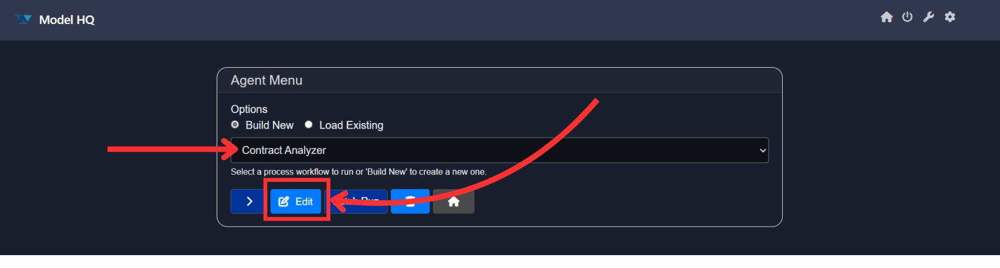
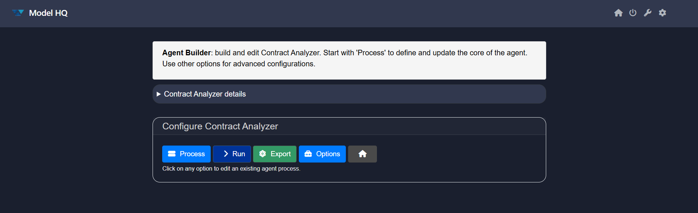
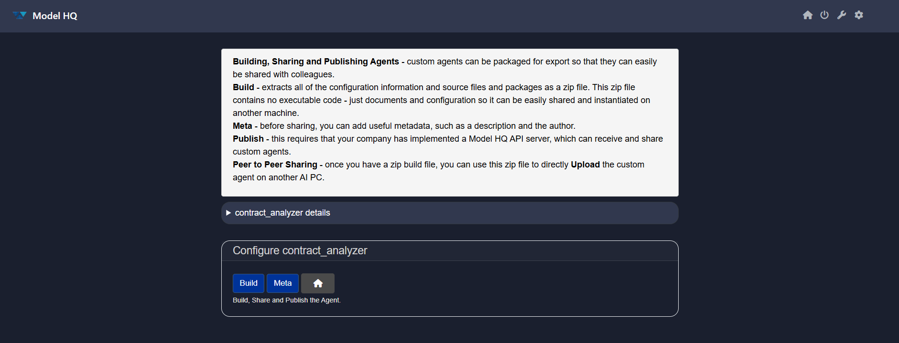
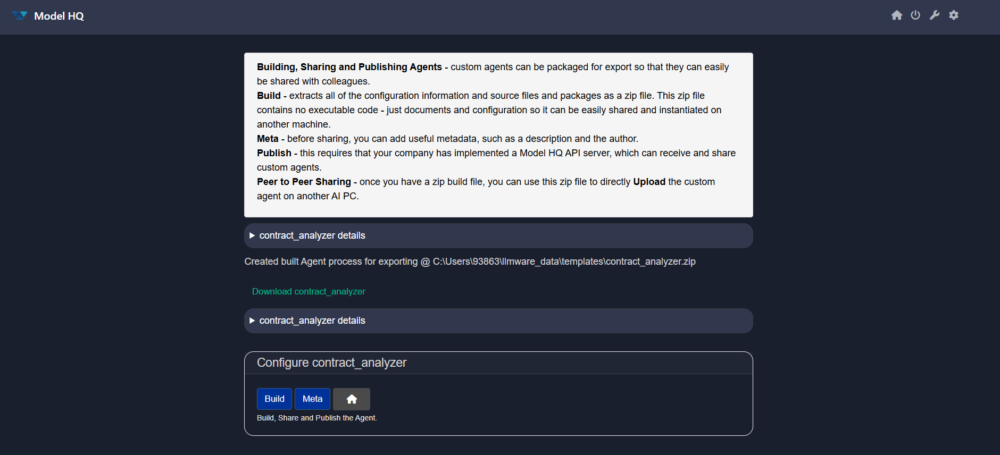
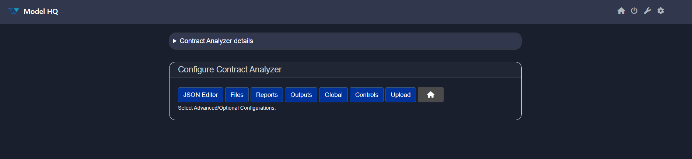
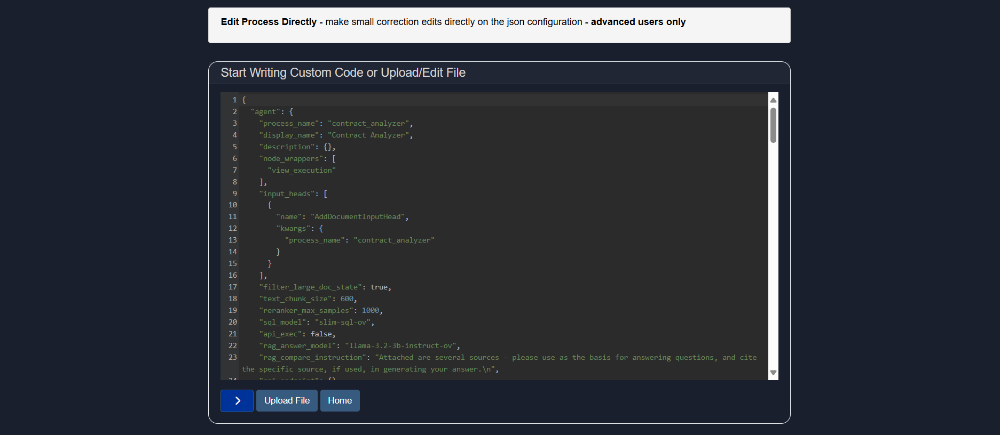
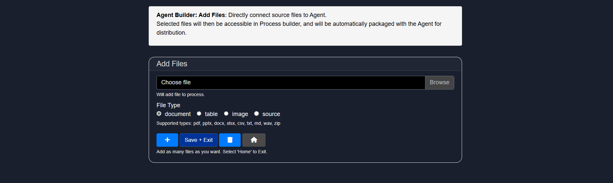
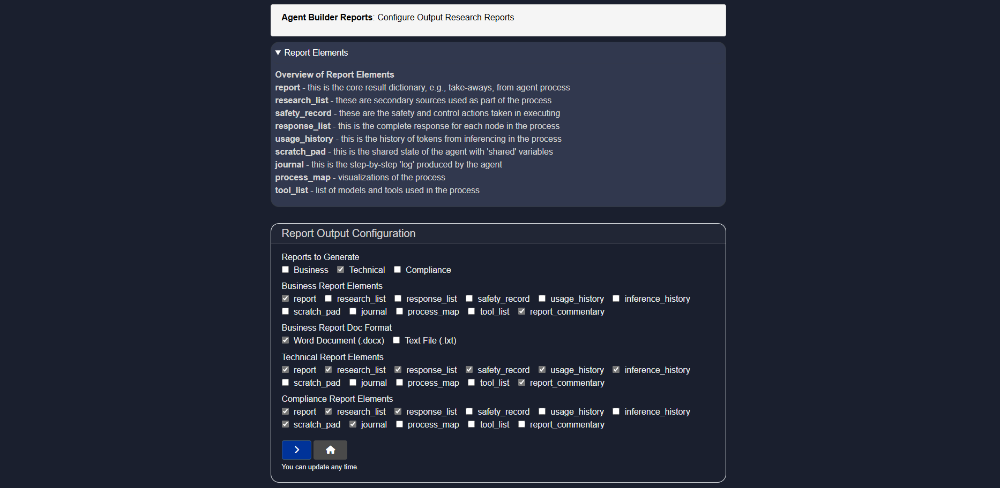
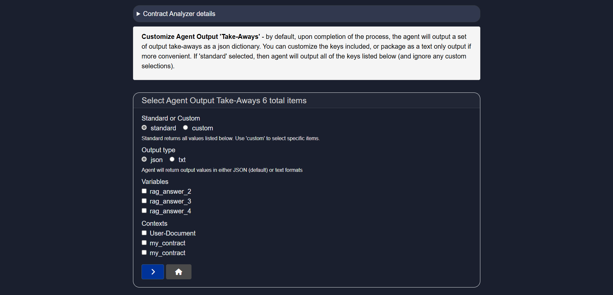
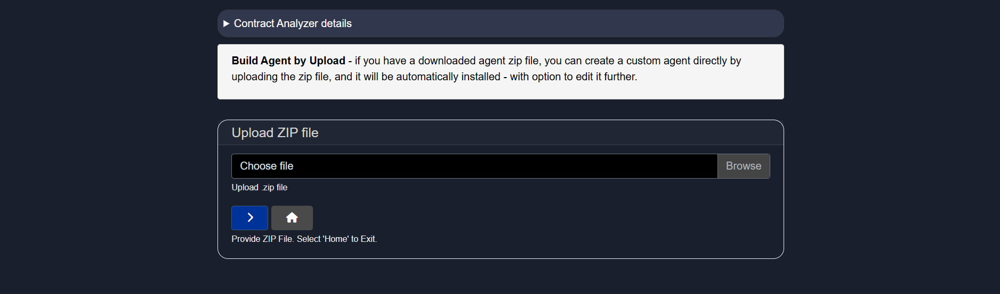

# Editing Agents in Model HQ
In this section, we will explore how to edit an existing Agent.

&nbsp;

## Open the Edit Interface
Editing an existing Agent process is straightforward in Model HQ.

Select the Agent you want to edit from the dropdown.

We will use the Contract Analyzer example to illustrate this process. (Editing the Contract Analyzer Agent process is also shown in our YouTube video: https://youtu.be/UTNQxspDi3I)

Click the `Edit` button.

### How to Edit an Agent?

To **edit an existing Agent**, select the **Agent Process** you want to modify and click **‘Edit’**.

Next, select **‘Process’** — this opens a **detailed view** of the steps inside the Agent Process.

You can:

* Press **‘+’** or **‘–’** to **add or delete rows**
* Modify the **Service**, **Instruction**, or **Context** as needed

> [!TIP] 
> After editing each row, click **‘>’** to apply the changes.
> The new **Context** and updates **won’t be saved** until you do this.

Depending on your edits, you might also need to **redefine**:

* **‘+ Inputs’**
* **‘+ Files’**

### 🌀 Editing a COPY of an Existing Process

If you plan to make **permanent changes**, we highly recommend editing a **copy** of the process instead.

To do this:

1. Go to **Agents > Build New > Start Building**
2. Give your new process a name in **Process Name**
3. Under **“Derive from Existing Process”**, select the existing Agent to copy
4. Click **`>`** to confirm

You’ll now see a **copy** of the selected process — ready to edit without affecting the original.

&nbsp;

## Edit Interface
You will now see the following screen:

At the top, there is a brief instructional guide.

Below it, you'll find the `details` section. Since we selected "contract_analyzer", it contains the corresponding details in JSON format. This includes every configuration related to the agent.

In the **Configure** menu, you will find several options, including:
- **Process**
- **Run**
- **Export**
- **Options**
- **Home**

Let’s review each button in detail.

## Process
To define each step in the agent workflow:

1. **Select a Service** — Choose the service the agent will use in this step.
2. **Add Instructions** — Provide a prompt or directive for the agent (e.g., a question).
3. **Select Context** — Optionally provide background data or source material to assist the agent.

Click `+ (Add)` to append a new step, or `- (Minus)` to remove the last one.

<<SERVICE TABLE HERE>>

The Agent Builder also includes the following options:
- **Inputs**: 
  Configure or update the user inputs defined during initial setup.
  
  Supported input types:
  - `MAIN-INPUT` — primary text input
  - `User-Document` — documents in various formats
  - `User-Image` — image files (e.g., PNG, JPG)
  - `User-Table` — structured data (CSV, JSON)
  - `User-Source` — multiple file sources
  - `User-Text` — short snippets
  - `None` — no user input required

  Specify the input types required from users to initiate the agent. This is a critical step as it is VERY IMPORTANT to **select all of the correct inputs that will be used** in the Agent process. By default, `MAIN-INPUT (text)` is set. 

  - `MAIN-INPUT (text)`: refers to a piece of text that will be copied and pasted into the text field - the current limit is 5000 characters for this text field (approximately up to 2 pages of text).

  - `User-Document`: A larger document which must be PARSED first via the 'parse_document' service in the Agent 'Select Service' prior to being used in an agent workflow. **Important: A User Document must almost always be processed first via the 'parse_document'**, which then breaks up the document text into smaller chunks, prior to being used for other Agent Services such as Rag_Answer, Semantic_Filter, Document_Filter or Create_Context.
     
  - `User-Table`: A user can upload a .CSV or JSON that the agent will attempt to interpret as a table with labelled columns and a consistent set of rows that it can label. **Important: A User Table must first be processed via 'build-table' service** prior to being used in an Agent process from the 'Select Service' dropdown. The Build Table service will attempt to extract relevant information and save the information in a local SQL database in Model HQ prior to using any table in an Agent process.

    The agent process must 
      1) upload a table, 
      2) 'Build_Table' from the Agent 'Select Service' dropdown (this service extracts all the information and attempts to build a database table from the information submitted), and 
      3) 'Query_Custom_Table' (this service expects an input context that is a table inference from the 'Build_Table' service) which allows a user to ask a simple natural language question from the Table.
     
  - `User-Image`: A user can upload an image file such as .PNG or .JPEG for image processing in an agent workflow. **Imporant: A User Image must first be processed via the 'vision' service** prior to being used in an Agent Prprocess from the 'Select Service' dropdown menu. The Vision service will take an image file along with a text input of a question or instruction, then returns a text output context with the answer based on the contents of the image.
     
  - `User-Text`: Designed to be a secondary piece of additional context that a user can provide in an Agent workflow.
     
  - `User-Source`: A User Source allows the user to upload an indefinite number of documents, images, etc. that can all be packaged as a source to be treated as one object. While most use cases have single or few inputs, this allows for more dynamic, flexible method of allowing for variable user input. If you select User Source, you do not need to go through the Parse_Document, Build_Table, or Vision services as these services will automatically be applied. **Imporant: It is recommended to use 'Text_Filter'> 'Semantic_Filter' > 'Create_Context' first** when being used in an agent process to surface the most relevant text chunks. As you get more advanced in Agent building, this order can change.

  > [!IMPORTANT]
  > It is important to select only the user inputs you expect to use in the process. The user will be expected to designate all of the inputs selected to run the process.

  > [!Tip]
  > Specify the input types required from users to initiate the agent. This is a critical step as it is VERY IMPORTANT to select all of the correct inputs that will be used in the Agent process. By default, MAIN-INPUT (text) is set. MAIN-INPUT (text) refers to a piece of text that will be copied and pasted into the text field - the current limit is 5000 characters for this text field (approximately up to 2 pages of text).

  > [!DANGER]
  > As the Agent process is being built, the `+ Inputs` selection button gives the developer of an Agent process the ability to modify the Input list (select or deselect the input list) depending on the Agent process being created.

  Once configured, click `>` to proceed.

- **Files**:  
  Upload files to be used in the agent workflow. Specify the file type as Document, Table, Image, or Source (a combination of different file types, usually large in size). You can also query a pre-built aggregated source for use in the workflow.

- **Load**:  
  Load a pre-built agent workflow to use or modify.  
  > [!CAUTION]
  > Using the Load button will replace any current process on the screen. Edits must begin from the loaded workflow.

- **Run**:  
  Navigate to the confirmation screen. Click `>` to proceed or select 'Home' to return to the previous page.

- **Reset (🗑️)**: Clears the screen and resets the configuration.

- **Home**: Returns to the Main Menu.

> [!NOTE]  
> Find the detailed description of every button [here](link_here).

&nbsp;

## Run
Runs the existing Agent without making any changes.

&nbsp;

## Export
Custom agents can be exported for easy sharing with colleagues who have Model HQ installed.

The Export section provides two options:
1. **Build**
2. **Meta**

### Build
Packages all configuration settings and source files into a `.zip` file.  
> 📦 The zip contains no executable code; only documents and configuration files—so it can be easily shared and imported on another system.

### Meta
Allows you to add useful metadata like instructions for the user such as description of the agent process, instructions for usage (ex: which types of inputs the user is expected to provide that works with this agent process) and author information.

You can add the following metadata:
- **Process Description**: Displayed to help users understand the purpose of the agent.
- **Sample Input**: Add a sample input or attach a file for testing and demonstration purposes.

&nbsp;

## Options
Opens a "Configure [Agent Process Name]" screen with the following configuration options:

### JSON Editor
Enables advanced users to modify the agent process directly in JSON. You can edit inline or upload a pre-configured JSON file.  

### Files
Attach source files directly to the Agent. These files will be available in the Process Builder and included in exported packages.  

### Reports
Configure the types of reports the agent can generate. This includes:
- Report Types to Generate
- Business Report Elements
- Business Report Document Format
- Technical Report Elements
- Compliance Report Elements  

### Outputs
Customize the output format of the agent process. By default, the agent returns a JSON dictionary with key takeaways. You can:
- Modify the output keys
- Switch to a text-only format
- Use the `standard` option to ignore custom settings and include all default keys  

### Global
Set global configuration options such as chat models and custom instructions.  

### Controls
Configure controls like Model Hash Checks, Pattern Redaction, and Classifier Tests used during the agent process.  

### Upload
Upload an agent `.zip` file to build a custom agent. Once uploaded, the agent will be installed and can be further edited.  

### Home
Returns to the previous Agent Menu screen.

&nbsp;

## Conclusion
In this section, we covered how to edit agents using the multiple configuration options provided in Model HQ. From modifying workflows to customizing exports and adding global settings, Model HQ offers a complete interface to refine your agents with ease.

If you require further assistance or would like to provide feedback, please contact us at `support@aibloks.com`.
