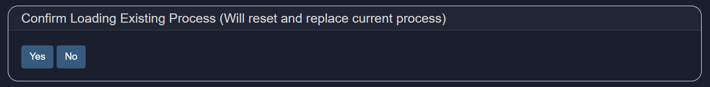

# Exploring Agent Builder Options
This is where you construct the core logic of your agent.

## Building the Process
To define each step in the agent workflow:

1. **Select a Service** — Choose the service the agent will use in this step.
2. **Add Instructions** — Provide the agent with a prompt or directive (e.g., a question).
3. **Select Context** — Optionally provide source material or background data to assist the agent.

Click `+ (Add)` to append a new step, or `- (Minus)` to remove the last one.

The Agent Builder also includes the following options:
- **Inputs**: This section lets you configure or update the user inputs defined earlier during setup.

- **Files**: This button allows the user to Add files that will be used in the Agent workflow with the option to explicitly indicate whether the file type is a Document, Table, Image or a Source (a mix of different file types, typically larger in size). In addition, the user can also query a pre-built aggregated source to be used in the agent workflow.

- **Load**: This button allows the user to Load a pre-built Agent workflow to use or to modify the workflow. Please note that the Load button will replace any current process on the screen, and all edits to existing workflows must start with the Loaded Workflow first.
  
- **Run**: Takes the user to the confirmation screen asking the user to select '>' to proceed to the agent process or to select 'Home' to return to the previous screen.
  
- **Reset (🗑️)**: Resets the entire screen.
  
- **Home**: Takes the user to the Main Menu

Let’s review each of these options in detail.

## Inputs
The **Inputs** section lets you configure or update the user inputs defined earlier during setup. 

Supported input types:
- `MAIN-INPUT` — primary text input
- `User-Document` — documents in various formats
- `User-Image` — image files (e.g., PNG, JPG)
- `User-Table` — structured data (CSV, JSON)
- `User-Source` — multiple file sources
- `User-Text` — short snippets
- `None` — no user input required

Specify the input types required from users to initiate the agent. This is a critical step as it is VERY IMPORTANT to **select all of the correct inputs that will be used** in the Agent process. By default, `MAIN-INPUT (text)` is set. 

- `MAIN-INPUT (text)`: refers to a piece of text that will be copied and pasted into the text field - the current limit is 5000 characters for this text field (approximately up to 2 pages of text).

- `User-Document`: A larger document which must be PARSED first via the 'parse_document' service in the Agent 'Select Service' prior to being used in an agent workflow. **Important: A User Document must almost always be processed first via the 'parse_document'**, which then breaks up the document text into smaller chunks, prior to being used for other Agent Services such as Rag_Answer, Semantic_Filter, Document_Filter or Create_Context.
     
- `User-Table`: A user can upload a .CSV or JSON that the agent will attempt to interpret as a table with labelled columns and a consistent set of rows that it can label. **Important: A User Table must first be processed via 'build-table' service** prior to being used in an Agent process from the 'Select Service' dropdown. The Build Table service will attempt to extract relevant information and save the information in a local SQL database in Model HQ prior to using any table in an Agent process.

  The agent process must 
    1) upload a table, 
    2) 'Build_Table' from the Agent 'Select Service' dropdown (this service extracts all the information and attempts to build a database table from the information submitted), and 
    3) 'Query_Custom_Table' (this service expects an input context that is a table inference from the 'Build_Table' service) which allows a user to ask a simple natural language question from the Table.
     
- `User-Image`: A user can upload an image file such as .PNG or .JPEG for image processing in an agent workflow. **Imporant: A User Image must first be processed via the 'vision' service** prior to being used in an Agent Prprocess from the 'Select Service' dropdown menu. The Vision service will take an image file along with a text input of a question or instruction, then returns a text output context with the answer based on the contents of the image.
     
- `User-Text`: Designed to be a secondary piece of additional context that a user can provide in an Agent workflow.
     
- `User-Source`: A User Source allows the user to upload an indefinite number of documents, images, etc. that can all be packaged as a source to be treated as one object. While most use cases have single or few inputs, this allows for more dynamic, flexible method of allowing for variable user input. If you select User Source, you do not need to go through the Parse_Document, Build_Table, or Vision services as these services will automatically be applied. **Imporant: It is recommended to use 'Text_Filter'> 'Semantic_Filter' > 'Create_Context' first** when being used in an agent process to surface the most relevant text chunks. As you get more advanced in Agent building, this order can change.

> [!IMPORTANT]
> It is important to select only the user inputs you expect to use in the process. The user will be expected to designate all of the inputs selected to run the process.

> [!Tip]
> Specify the input types required from users to initiate the agent. This is a critical step as it is VERY IMPORTANT to select all of the correct inputs that will be used in the Agent process. By default, MAIN-INPUT (text) is set. MAIN-INPUT (text) refers to a piece of text that will be copied and pasted into the text field - the current limit is 5000 characters for this text field (approximately up to 2 pages of text).

> [!DANGER]
> As the Agent process is being built, the `+ Inputs` selection button gives the developer of an Agent process the ability to modify the Input list (select or deselect the input list) depending on the Agent process being created.

<<SERVICE TABLE HERE>>

Once configured, click `>` to proceed.

&nbsp;

## Files
Upload supporting files for the agent's process logic. Supported formats include:
`.pdf`, `.pptx`, `.docx`, `.xlsx`, `.csv`, `.txt`, `.md`, `.wav`, `.png`, `.jpg`, `.zip`

Click `Save + Exit` after uploading your files. To delete a file, click the bin icon (🗑️).

&nbsp;

## Load
Use this option to import an existing agent process. This will override your current session.

&nbsp;

## Run
Execute the agent workflow you've just created to test and validate its behavior.

Once the agent has been fully constructed, a summary view will display the configuration and logic flow. This view helps you verify the structure and ensure all steps have been defined as expected.

Click on the `Run` button to proceed. Now you'll be asked to add a text or attach a file to process your created agent.

Once done, you agent will start working and give you the output like below:

&nbsp;

## Reset (🗑️)
This will clear the current agent configuration and start fresh.

> [!WARNING]  
> This action is irreversible and will permanently delete your progress.

&nbsp;

## Conclusion
In this section, you have explored the Agent Builder Options in more detail.

If you require further assistance or wish to provide feedback, feel free to contact us at `support@aibloks.com`.
