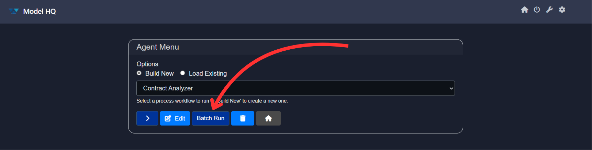
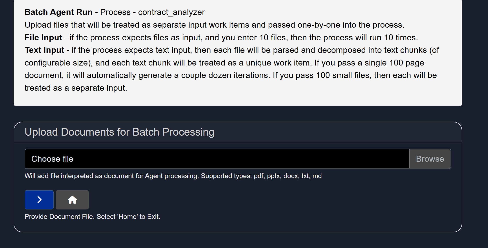
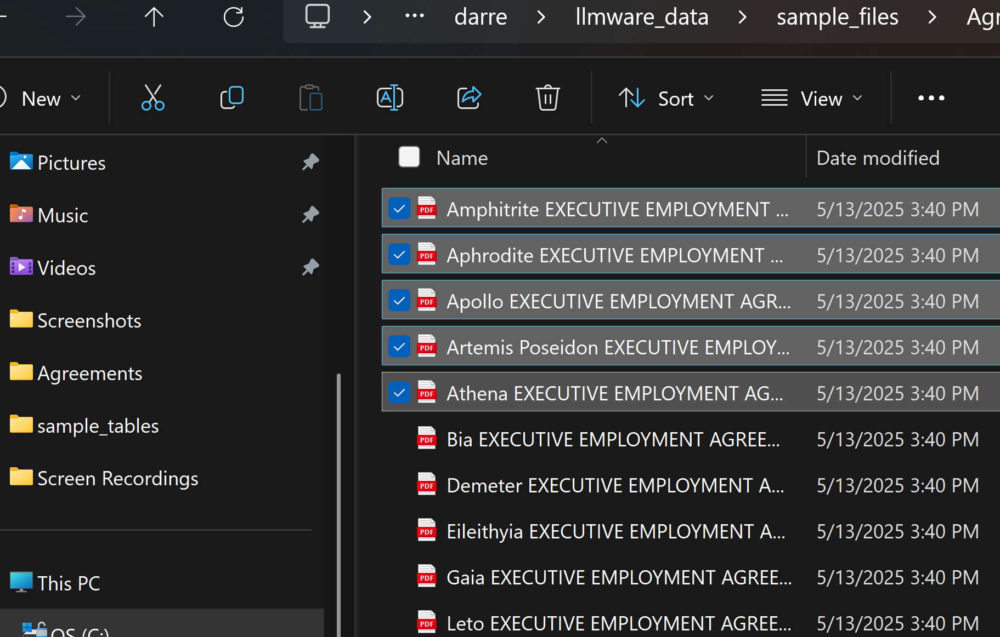
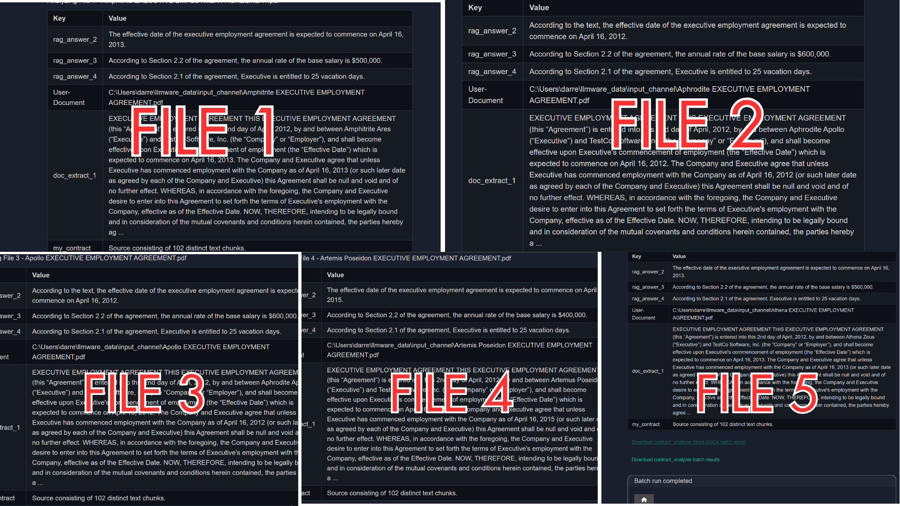

# Multi-Doc Agent or Batch Run
In this Section, we will explore using the **Batch Run** capabilities of Model HQ.

**Batch Run** is designed to automate the execution of an Agent process across multiple documents at once, without the user having to load each document one-by-one.

We will use the **Contract Analyzer** example we covered in Agents to provide an example of a Batch Run and how to use this feature.  
(A video of this agent process running in Batch Run mode can also be found in our YouTube Channel – [https://youtu.be/FSjpAgIZnPM](https://youtu.be/FSjpAgIZnPM))

&nbsp;

Once you have selected **'Batch Run'**, you will be directed to the **Upload Documents for Batch Processing** page.

From here, select for our example the first 5 agreements from the sample files that are provided in the Model HQ package that can be found under `c:\users\{user name]\llmware_data\sample_files\agreements`

Then select `'>'` to start the batch run.

&nbsp;

Within a few minutes, each of the 5 contracts will be processed in this Batch Run. Here are the examples of the results:

&nbsp;

Once the **Batch Run** is completed, the user will have access to the results via a **Word document** or a **JSON file**, depending on the use case.

Batch Run can be applied to almost any Agent workflow where a user needs to apply the workflow against a number of various files.
