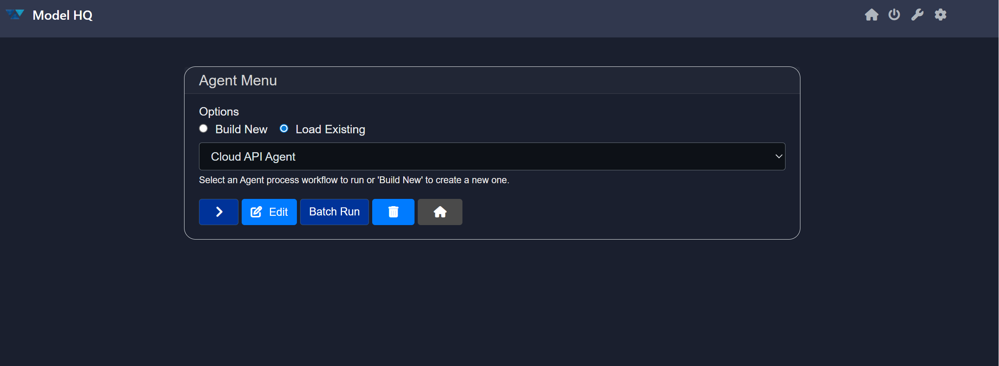
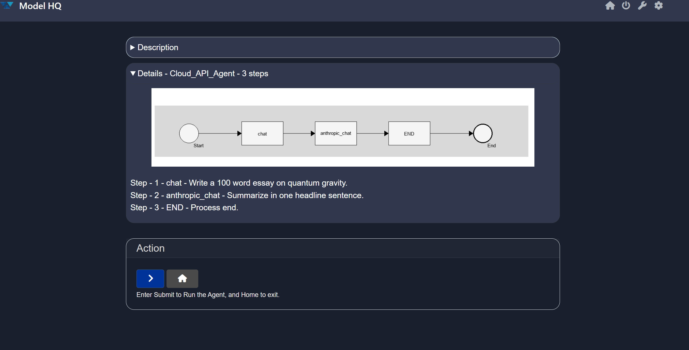
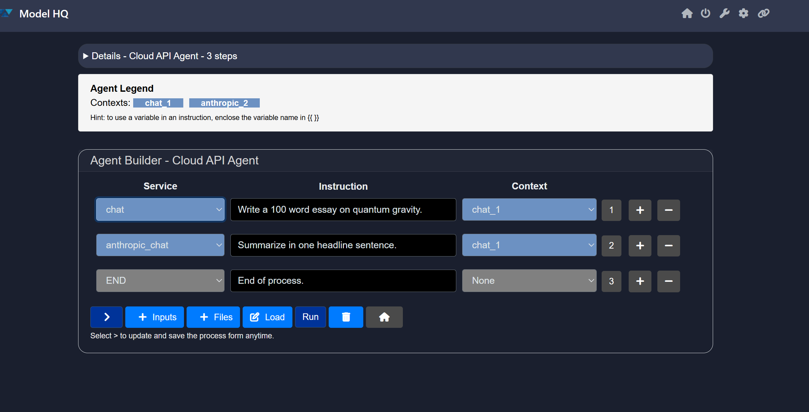
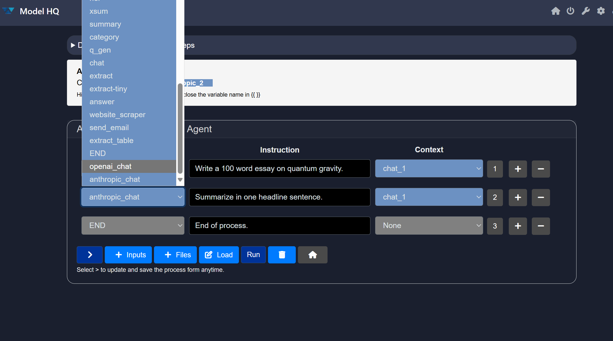
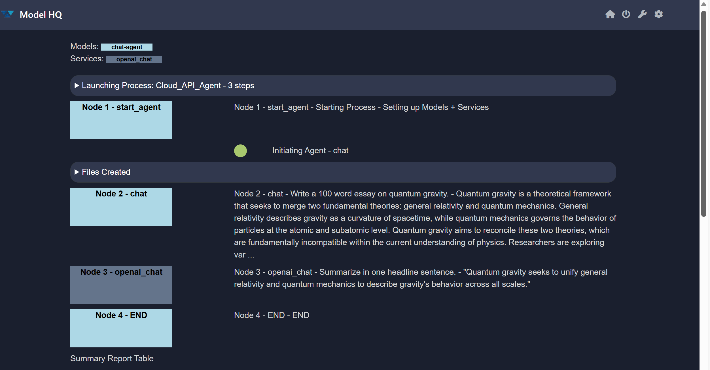

# Using Open AI or Anthropic Models

Frontier Models such as **OpenAI** or **Anthropic** can be utilized in building Agent workflows in Model HQ.  
Users can access a short example via:

```
Agents > Cloud API Agent > Details
```



This allows quick testing to verify whether the API connection is successful.

&nbsp;

## Default Setup
The **template Agent workflow** is set to **Anthropic** by default.

To use this workflow successfully, you must enter your API key for the desired model in:

```
Configs (top right corner) > Credentials > Anthropic API key
```



&nbsp;

## Switching to OpenAI

To change the Agent workflow test to **OpenAI**, follow these steps:

1. Go to:
   ```
   Agents > Cloud API Agent
   ```
2. Click on:
   ```
   Edit > Process
   ```
   

3. Locate the **second row** and change:
   ```
   anthropic_chat → openai_chat
   ```
   

4. Click `>` to proceed.

&nbsp;

> [!NOTE]
> The **first step** of the process (`chat`) uses a **default local model**.  
It does **not** use an external model and is intended as a **quick test** to ensure your models are connected properly.

&nbsp;

> [!IMPORTANT]
> 
> Make sure to set the **Context** of `Chat_1` to **None** in the first row. (The context of OpenAI should correctly remain as `Chat_1`)
>
> There is no context needed for this model to provide a valid > answer.  
> This option may become available **only after clicking `>`** > following the model change in the Cloud API Agent workflow.

&nbsp;

## Final Steps

1. Click `Run > >` run the agent with OpenAI as new llm provider:

2. You will see a completed Agent workflow similar to the responses below.


&nbsp;

This confirms that you are now able to successfully utilize **Anthropic** or **OpenAI** in your **Agent workflow**.
