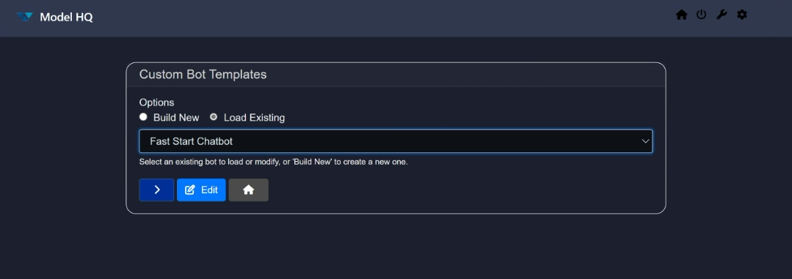

## Exploring `Bots` in Model HQ
Once you complete the initial setup, you will be directed to the **Main Menu**.
This interface offers multiple functionalities; in this section, we will focus specifically on the **Bots** feature. The Bots feature allows users to create their own custom Chat and RAG bots seamlessly for either the AI PC/edge device use case (Fast Start Chatbot and Model HQ Biz Bot) or via API deployment (Model HQ API Server Biz Bot).

&nbsp;

### 1. Launching the Bots Interface
Click on the **Bots** button from the main menu to get started.


&nbsp; 

### 2. Understanding the Bots Interface
You will land on an interface similar to the one shown in the screenshot.


Here you will get multiple options. Let's briefly go over each button:

1. **Options**:
   Allows you to choose whether you want to create your own custom bot or load an existing one.

   * **Build new**: Create a new bot from scratch.
   * **Load Existing**: Load a previously created or existing bot.

2. **Dropdown**:
   Allows you to switch between the existing bots.

3. **Next or `>`**:
   Proceed button.

4. **Edit**:
   Allows you to edit the selected bot.

5. **Home**:
   Takes you back to the main menu.

&nbsp;

Manually, the **Load Existing** button is selected, so let's try it out first.
### 3. Loading an Existing Bot

To load an existing bot, just select a bot from the dropdown (or leave it as the already selected one), and then click on the `>` button.

The bot will begin loading and will look like this:


It usually takes less than a minute to load (depending on your internet speed). After that, you will land on the [Chat Interface](https://github.com/RS-labhub/ModelHQ-Docs/blob/master/chat/CHAT.md#4-understanding-the-chat-interface).

&nbsp; 

### 4. Creating a New Bot 

To create a new bot from scratch, choose **Build new** and click `>`. If you choose **Build new**, you will first be prompted to name your Bot. Enter the name of the Bot in the Configure Bot screen and click `>` to proceed.

### 5. Configuring a New Bot or Editing an existing bot

The interface for creating a new bot or editing an existing one (after you click the **Edit** button) is the same. Both have the same options. For this tutorial, we will show how to edit a Fast Start Chatbot. If you're creating a new bot, follow the same steps as shown in Models button below. 

Click on the **Edit** button in the bots screen or 
You will land on this screen:


Now we will look into each button one by one:

* Models
* Files
* RAG
* Options
* Run
* Export
* Delete (🗑️)
* Home

#### a. Models button
This is one of the most important buttons while building or customizing a bot.

The **Models** button allows you to select models from the catalog to be implemented in the bot and to specify a variety of related configurations. You can select the chat model, ranker model, vision model, and SQL model. Based on the size of the model, the dropdown shows you available options.

-> <ins>Model Size and Model Selection</ins>: When you select the Model Size (choices are Small, Medium or Large), you will see the corresponding models in the next dropdown - Model Selection.

-> <ins>Model User Input</ins>: This allows the developer to indicate whether the end user will be permitted to select the model or whether the end user will use the model preselected for them in this configuration screen.

-> <ins>Execution Mode</ins>: Specifies whether the model will be run locally, via an API or whether the user will have a choice to select between the two modes.

-> <ins>Specialized Agents</ins>: The chatbots also have the ability to ingest tables, .csv files, images and documents for text-to-SQL capabilities, document searching (RAG) or image processing (Vision). The developer will have the opportunity to indicate whether one or more of these three Specialized Agents capabilities will be permitted within the chatbots and to make a model selection (for Vision).

You can also select the **execution mode** and **generation settings** by indicating:
  - whether the capability to Sample is ON or OFF
  - the max output token limit
  - the temperature.

"**Sampling**" in AI model inferencing is the process of selecting possible output values (such as words or tokens) from a probability distribution generated by the model, often to introduce variability or control randomness in the response. Sample OFF ensures repeatability of results whereas Sample ON provides more variability in responses.

"**Max Output**" determines the maximum length of response of the model.

"**Temperature**" controls the randomness of the model's output, with higher values producing more diverse and creative responses, and lower values yielding more focused and deterministic results.

If you do not make a selection, the default options will be chosen based on the best models available for the size.

Once configured, click on `>` to save your changes.


#### b. Files button
Another crucial button for your bot.

You’ll be prompted to attach files that will act as sources for the bot. After attaching a file, select its type from the radio options. Supported types include: `.pdf`, `.pptx`, `.docx`, `.xlsx`, `.csv`, `.txt`, `.md`, `.wav`, `.png`, `.jpg`, `.zip`.

Click on `Save + Exit` to save the source. If you want to reuse sources later, select them directly from the **Sources** section.
Sources indicate a group of one or more documents that have been previously uploaded that a user may want to reuse in a query at a later time.
To delete a saved source, select it and click on the delete icon (🗑️).

To add multiple files, click the **`+`** icon.

> [!CAUTION]
> If you don’t select any files, the bot will behave as a normal chatbot. You can still add sources later from the [chat interface](https://github.com/RS-labhub/ModelHQ-Docs/blob/master/chat/CHAT.md#source-button-enabling-rag--chatting-with-documents), but they won’t persist after restarting.


#### c. RAG button
Update the RAG configurations for your custom bot. It allows you to choose what you want as a source and other context-related settings that can impact the result of the output for maximum control and flexibilty for the developer.


-> <ins>Supported Modes of Additional Source Information</ins>: This allows the developer to control whether the user will be able to connect to additional sources of information from files, library connection (API connection), Tables, Images, Sources (previously saved grouping of files) and/or Wikipedia.

-> <ins>Text Chunk Size</ins>: Text chunk size in parsing refers to the amount of text, measured in tokens, that is processed as a single unit during analysis or transformation of the file to a searchable body of text. Selecting the right text chunk size is important because it affects how accurately and efficiently a model can understand, process, and retrieve information—too small, and context may be lost; too large, and it may exceed model limits or reduce performance.

-> <ins>Context top n</ins>: Context Top N refers to selecting the top N most relevant pieces of information (e.g., text chunks) from a larger context based on similarity to a query, and it's important because it ensures the model focuses on the most pertinent data to generate accurate and relevant responses.

-> <ins>Context target size</ins>: Context target size is the predefined maximum amount of text (in tokens) that can be included in a model’s input, and it balances the trade-off between including enough relevant information and staying within the model’s processing limits to ensure efficient and coherent responses.

-> <ins>Reranker max samples</ins>: Max samples in a reranker model refers to the maximum number of candidate items (e.g., documents, passages, or text chunks) that the model will consider and score for relevance, and it's important because it sets a limit to ensure computational efficiency while still allowing the model to choose the most relevant results from a sufficiently broad pool.

-> <ins>Prompt instruction added to prompt context to compare multiple source documents</ins>: Default instructions are included but please feel free to experiment.

-> <ins>Prompt instruction passed to RAG</ins>: No default instructions are added. Developer is free to experiment.

-> <ins>Use Wikipedia as Source</ins>: This button allows the user access to Wikipedia as a reference while using the chatbot.


#### d. Options button
This optional but important section gives you more control over your bot, UI, upload settings, etc.


Here’s a breakdown of each sub-option:
* **Controls**:
  Allows developers more configuration options by offering settings like logs, validation, model pull repository selection, download controls, pattern redaction, and classifier tests.
  

**Control Configuration Options** includes many Safety and Security features of Model HQ:
  - <ins>LLMWare Model Repository</ins>: Option includes ability to download models directly from LLMWare's private model repository in Azure (recommended) or Huggingface. Please note that Huggingface faces outages and downtimes, as well as changes to their code, which sometimes interferes with the ability to access their repository.
  - <ins>Validate Model Hash on Download</ins>: Important safety feature that ensures the file hasn’t been tampered with or corrupted during download, protecting against malicious code and safeguarding data integrity. It also ensures reproducibility by confirming you’re using the exact version intended by the model provider.
  - <ins>Validate on Every Load of the Model or Skip Validation</ins>: Determines the frequency of the model safety hash check.
  - <ins>Pattern Redaction</ins>: Allows for automatic redaction on various forms of personally identifiable information data including US Social security numbers, ABA routing numbers, email addresses, credit card information, driver's license numbers, passport information, dates, IBAN information, Indian PAN number (in pan), url, crypto or phone numbers.
  - <ins>Classifier Tests</ins>: By selecting any of the boxes such as prompt injection detection, toxic detection, language detection, bias detection or malicious url detection, Model HQ auto-runs a model to detect any of the selected forms of safety checks before displaying the inference results.

* **UI**:
  Allows for fast and easy customization of the UI, bot name, icons, color, and other visual elements.
  

* **Upload**:
  Already have a bot zip file? Upload it here to automatically install it in Model HQ.
  

* **JSON Editor**:
  Want a simple way to create or edit a bot? Use the built-in JSON editor. Templates are available to guide you. If you already have a JSON file, upload it via the **Upload** button.
  

  Here's a sample:
  ```json
  {
  "name": "fast_start_simple_chatbot",
  "display_name": "Fast Start Chatbot",
  "model_name": "phi-3-ov",
  "execution_mode": "Local",
  "user_select_model": "Choose for User",
  "description": "Fast Start simple bot configuration",
  "max_output": 1000,
  "temperature": 0,
  "sample": false,
  "text_chunk_size": 600,
  "top_n_sources": 3,
  "supporting_models": ["vision_model", "sql_model", "ranker_model"],
  "table_support": true,
  "vision_model": "qwen2-vl-2b-instruct-ov",
  "sql_model": "slim-sql-ov",
  "ranker_model": "jina-reranker-v1-tiny-en-ov",
  "local_exec": true,
  "connected_library": [],
  "connection_types": [
    "File Upload",
    "Library Connection",
    "Images",
    "Tables",
    "Sources",
    "Wikipedia"
  ],
  "source_name": [],
  "api_exec": false,
  "api_endpoint": null,
  "web_search": null,
  "web_search_config": null,
  "patterns": ["us_ssn", "email", "credit_card"],
  "classifiers": [],
  "write_to_db": false,
  "model_repo": "Azure",
  "allow_download_chat_history": true,
  "allow_generation_config": true,
  "single_app_mode": "Standard Mode",
  "files": [],
  "install_bot_files": [],
  "ui_configs": {
    "theme": "dark",
    "app_title": "Model HQ",
    "title": "Model HQ",
    "company_name": "LLMWare",
    "company_url": "https://www.llmware.ai",
    "header_color": "#31384E",
    "footer_color": "#31384E",
    "main_color": "#1A1F2E"
  },
  "last_modified": "2025-05-24_052544",
  "created": "2025-05-24_052544",
  "author": "Radhika Sharma",
  "bot_table_files": [],
  "bot_image_files": [],
  "bot_document_files": [],
  "rag_compare_instruction": "Attached are several sources - please use as the basis for answering questions, and cite the specific source, if used, in generating your answer.\n",
  "rag_aggregate_instruction": "",
  "use_wikipedia": true
  }
  ```

* **Delete (🗑️)**:
  Deletes all changes you’ve made. 

&nbsp;

#### e. Run button
This button takes you to the [Chat Interface](https://github.com/RS-labhub/ModelHQ-Docs/blob/master/chat/CHAT.md#4-understanding-the-chat-interface).

&nbsp;

#### f. Export button

Custom bots can be exported to share with others easily.


* **Build**:
  Packages all config and source files into a zip (no executable code).
  

* **Meta**:
  Add metadata such as description and author before publishing.
  Requires a ModelHQ API server for publishing.
  

* **Peer to Peer Sharing**:
  Use the zip file to upload the custom bot to another AI PC.

&nbsp; 

### 6. Delete
Deletes the bot you’re currently creating or editing. Existing bots can be deleted by clicking `Bots`, selecting the Bot's name from the scroll menu, `edit`, then the `delete (trash can icon)` and confirming the deletion.

&nbsp;

### Conclusion
In this documentation, we explored the **Bots** functionality of Model HQ. We covered how to load an existing bot and how to create your own custom bot using various configuration options.

If you have any questions or feedback, please reach out to us at `support@aibloks.com`.
