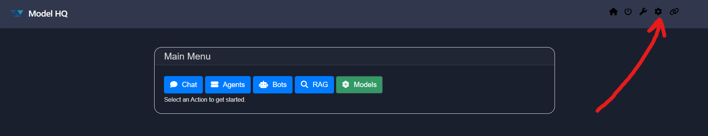
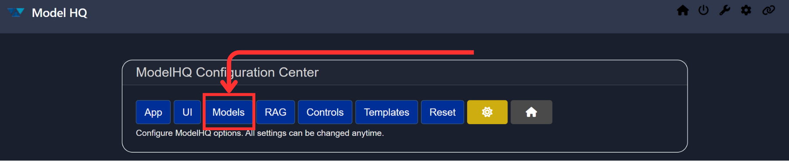
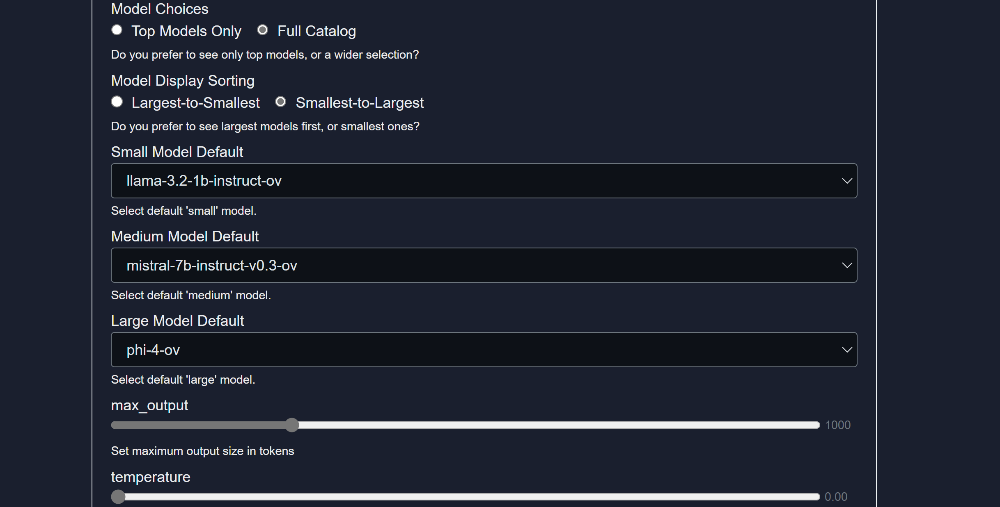

## Changing the Chat Model Configuration
To update the default model used for the **Chat** feature (Small, Medium, or Large), follow the steps below.

&nbsp;

### Step 1: Open Configuration Panel
Click the **Config** button(⚙️) from the main Chat Interface.  
You can locate it as shown below:

&nbsp;

### Step 2: Access Model Settings
You will now be redirected to a configuration interface.  
From here, select the **Models** tab:

&nbsp;

### Step 3: Modify Default Chat Model
The **Set Default Models** section will open.  
Scroll down to locate the **Chat** and **RAG** model settings, as shown below:

From this interface, you can select your preferred model for both general chat and RAG-based interactions.

> [!TIP]  
> Every model is different and has unique characteristics. Choose your models wisely and according to your specific use case.

&nbsp;

### Need Help?
If you encounter any issues while updating your model configuration, feel free to contact our support team at:  
**`support@aibloks.com`**
