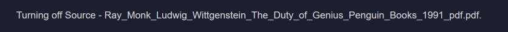

## Exploring `Chat` in Model HQ
Once you complete the initial setup, you will be directed to the **Main Menu**.  
This interface offers multiple functionalities; in this section, we will focus specifically on the **Chat** feature. The Chat feature allows users a fast way to start experimenting with chat models of various sizes, from Small (1-3 billion parameters), Medium (7-8 billion parameters) to Large (9 and above, up to 32 billion parameters). 

Users are able to select which size model they would like to interact with going through [Changing Chat Model in Model HQ](https://github.com/RS-labhub/ModelHQ-Docs/tree/master/chat/CHANGING_CHAT_MODEL.md).

&nbsp;

### 1. Launching the Chat Interface
Click on the **Chat** button from the main menu to get started.  

&nbsp;

### 2. Selecting a Model
You will be prompted with a screen asking you to choose a model for Chat or Retrieval Augmented Generation (RAG).  
Model HQ provides options based on performance, size, and speed — allowing you to select a model that fits your requirements.  
Once you have selected a model, click the `>` button to proceed.

#### Available Model Options:
- **Small Model**:  
  ~1-3 billion parameters — Fastest response time, suitable for basic chat.

- **Medium Model**:  
  ~7-8 billion parameters — Balanced performance, ideal for chat, data analysis and standard RAG tasks.

- **Large Model**:  
  ~9 up to 32 billion parameters — Most powerful chat, RAG and best for advanced and complex analytical workloads.

&nbsp;

### 3. Downloading Models
For demonstration purposes, we are selecting the **Small Model**.  
If no models have been downloaded previously (e.g., in the **No Setup**, **Fast Setup**, or **Full Setup** paths), the selected model will begin downloading automatically.  
This process typically takes **2–7 minutes**, depending on the model you selected and your internet speed.

Once the model download is complete, it will be automatically loaded (this typically takes less than a minute). After loading, you can begin interacting with the model through the Chat interface.

> [!TIP]
> If you encounter an error while downloading the model, please refer to the [Model Download Error Guide](https://github.com/RS-labhub/ModelHQ-Docs/tree/master/chat/ERROR.md) for troubleshooting steps and solutions.

&nbsp;

### 4. Understanding the Chat Interface

Once your model is loaded, you will be taken to the **Chat Interface**.  

This interface offers several powerful tools to interact with your model. We will explore each feature one by one:

1. Info Button
2. Configuration Button
3. Source Button
4. Save Button

But before diving into these features, let’s quickly try interacting with the chatbot using some demo questions — without enabling RAG (Retrieval Augmented Generation).

For instance, we asked the model, "What is the most famous equation given by Euclid?" and clicked on the **`>`** button. Check the result below:  

Feel free to experiment on your own — this is a basic chatbot setup. We’ll enable RAG functionality in the upcoming sections.

> [!NOTE]
> For this documentation, we are using the **Medium Model**. Previously, we demonstrated features using the **Small Model**. You can switch between models as needed.  
> Refer to: [Changing Chat Model in Model HQ](https://github.com/RS-labhub/ModelHQ-Docs/tree/master/chat/CHANGING_CHAT_MODEL.md)

&nbsp;

### Info Button

The **Info** button displays the current configuration settings for your chat model.  

This provides clarity on which model is in use and the configuration parameters currently applied.

&nbsp;

### Configuration Button

The **Configuration** button allows you to adjust the model settings for both RAG and generation.  
Here, you can customize parameters such as:

- Number of top text chunks  
- Target token size  
- Maximum output size  
- Temperature  
- Sampling settings  

For example, the **temperature** setting controls the randomness of the model's output.

Once you've modified the configuration, click **`>`** to save your changes. You can click the **Info** button again to verify your updates.

To see this in action, we asked, *"What is an Apple?"* using the same model but with different configuration settings.  

&nbsp;

### Source Button (Enabling RAG / Chatting with Documents)

The **Source** button enables you to load external documents or use Wikipedia to enhance your model's responses.  

You have several options here:

#### 1. Upload a File

Upload a document and chat within its context. Supported file formats include:

`.pdf`, `.pptx`, `.docx`, `.xlsx`, `.csv`, `.txt`, `.md`, `.wav`, `.png`, `.jpg`

Currently, the model is able to accept up to ~5 documents at once (depending on file size) for most file types, but cannot accept more than 1 .png, .jpg or .wav file at a time.

For demonstration, we used a ~800-page PDF: *"Ray Monk - Ludwig Wittgenstein: The Duty of Genius (1991)"*.  
We asked, *"How many children did Wittgenstein have?"* and received an great response — with references and match score.

> Try it yourself and share your feedback at: **support@aibloks.com**  
> *(Model used: Dolphin)*

To remove the current source, simply click the **Source** button again.  

Reopening the Source interface now shows an additional section: **Loaded Sources**. These remain available during the current Model HQ session.

#### 2. Saved Sources

This option lets you access previously uploaded files from your local storage.  
> *Note: Files are not stored on any external server.*

#### 3. Wikipedia as a Source

Select Wikipedia as a source for more factually accurate and up-to-date responses.

For example, we asked about the *Spiral Theory*. The chatbot responded with an in-depth answer along with source references.

To stop using Wikipedia, click the Source button again.  

&nbsp;

### Save Button

The **Save** button lets you export your chat session as a `.md` (Markdown) file.  

You can open this file with any text editor. Markdown-supporting editors will show it with proper formatting; others will display plain text. Below image shows the exported chat in a text editor i.e. as a plain text.

  

&nbsp;

### Conclusion

In this section, we explored the **Chat Interface** in Model HQ — from basic interactions to configuring the model and using RAG with external sources.

To change the chat model, refer to the guide:  
[Changing Chat Model in Model HQ](https://github.com/RS-labhub/ModelHQ-Docs/tree/master/chat/CHANGING_CHAT_MODEL.md)
