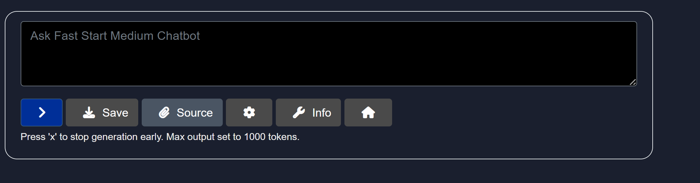
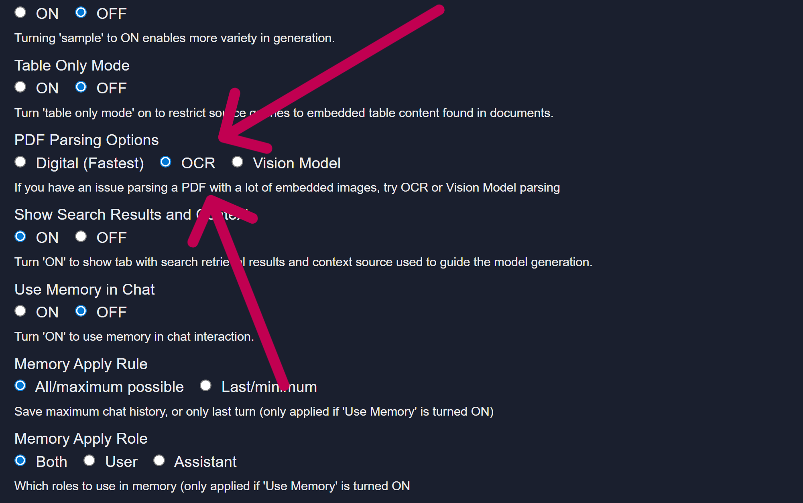

# Trouble Shooting Document Parsing and Limitations

Model HQ includes proprietary highperformance parsers designed to process PDFs and other common document types with exceptional speed and accuracy. These parsers extract text, structure, and metadata efficiently, supporting a wide range of use cases for retrieval, RAG workflows, and agentic AI.

However, some documents—particularly PDFs—may present unique challenges:

- **Imagebased PDFs**: Certain PDFs are saved entirely as images (e.g., scanned documents), meaning there is no underlying text layer to extract. These require OCR (Optical Character Recognition) to process the content.

- **Permissionrestricted PDFs**: Some PDFs use encrypted permissions that limit actions such as text extraction, copying, or printing. These restrictions may prevent direct parsing without prior decryption or appropriate access rights.

When encountering such files, additional preprocessing steps may be required before they can be ingested and indexed by Model HQ.

&nbsp;

## Handling Documents That Cannot Be Natively Parsed

In some cases, a document cannot be parsed by Model HQ’s native proprietary parsers due to being fully imagebased or having restrictive permissions.

### In Chat:
When attempting to load such a document, the system will respond with:

> [!IMPORTANT]
> “Unfortunately, source could not be loaded.”

### In Agents:
The Parsing step within the workload will complete but return 0 text blocks parsed, indicating that no extractable text was found and the Rag Answer step will not return responses.

&nbsp;

## Fallback Solution:

Model HQ includes an embedded OCR (Optical Character Recognition) capability that can be activated to process such documents. Enabling OCR allows Model HQ to detect and extract text from images, scanned pages, or restricted PDFs, making them fully searchable and usable in RAG and agent workflows.

### How to Activate OCR:
v**In Chat or Bots**, in the Dialogue section, select the icon beneath the chat box ‘⚙️’

Once in **RAG + Generation Config Options**, go to:

**PDF Parsing Options**, Select **OCR** and click ‘>’. Your document will be accessed via OCR and a previously locked PDF document will now be searchable.

**In Agents**, in lieu of Parse Documents, Select **OCR**.
