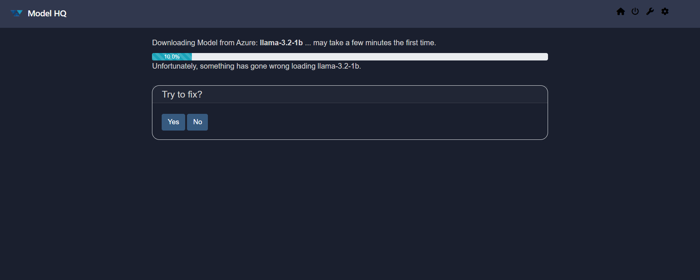
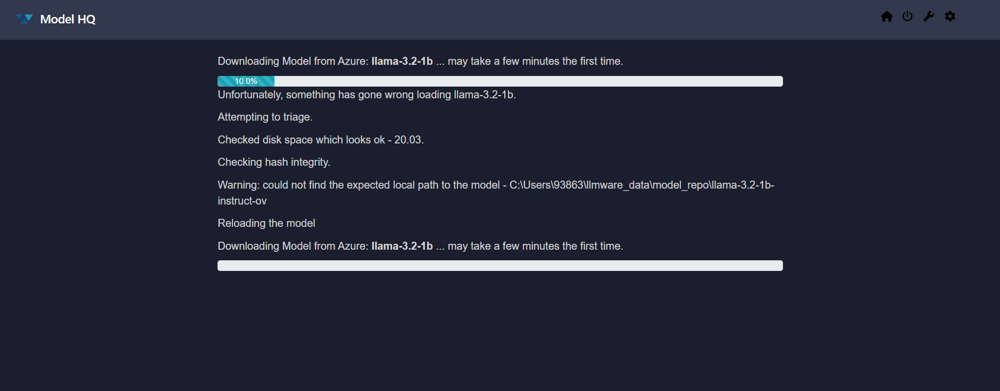
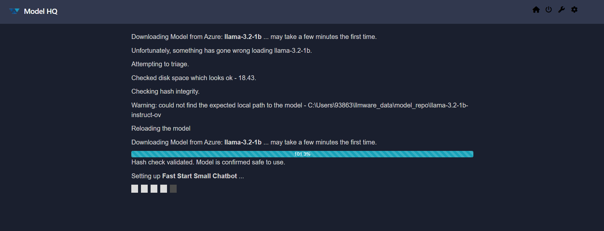

## Possible Errors: Unfortunately, something has gone wrong loading _model_name_
If you encounter any such issues during the download—such as the error prompt below:

Click **"Yes"** to retry and continue the download.  
> Clicking **"No"** will return you to the **Main Menu**.

After confirming, the interface should update to:

Once you confirm and continue the download, the interface will update to the following:

At this stage, the selected models will begin loading automatically after the download completes.  
Please wait for the loading process to finish before proceeding to use the Chat feature.

Most common causes of errors are usually attributed to not enough memory on device, disrupted WiFi connection, or device interruption of model download due to hibernation mode (refer to **System Configuration guide** for recommended system settings prior to downloading models).

&nbsp;
If the bug still persists, then reach out to us at `support@aibloks.com`.
