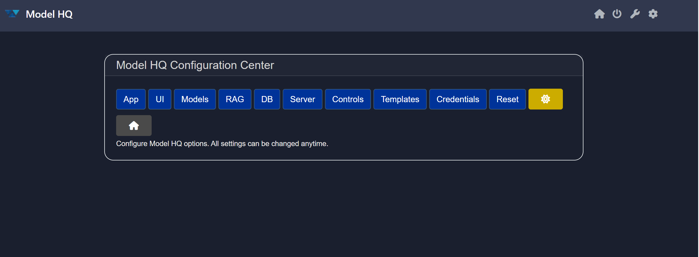

# Exploring `Configure` in Model HQ
Once the initial setup is complete, navigate to the **Main Menu**.  
Located on the top left corner of this menu, you will find the **Configure** section, denoted by the ❃ icon.

The Configure section provides a centralized interface for managing Model HQ's core settings—ranging from appearance customization and model configuration to database setup, RAG controls, and advanced safety and security options.

## 1. Launching the configure Interface
To begin, click on the **configure** button ( ❃ ) from the main menu present in the top right side.

 

## 2. Overview of the configure Interface
After launching the configure section, the interface displays the following key options:

It includes:
- **App**
- **UI**
- **Models**
- **RAG**
- **DB**
- **Controls**
- **Templates**
- **Credentials**
- **Reset**
- **Display mode** 🕸️ (light-dark mode toggle button)
- **Home**

 

## App button
App button is basically provides Model HQ Application Settings options.

It's faciliates you with the following options:

1. Dev Mode
  Turn 'on' to view developer and build options. Turn 'off' to deploy to end users. 
  
  >[!IMPORTANT]
  > If you turn OFF the dev mode (by default it's 'ON'), you won't be able to see the `models buttons` in the main-menu, and much of the instructions or helper text designed for developer will not be visible to end users.

2. App Mode
  Turn 'on' to display available Apps.

  >[!IMPORTANT]
  > If you turn OFF the app mode, then you will only be able to see the applications (like chat, rag, etc.) you've created.

3. Connected Enterprise Servers
  If you have an enterprise account, and want to be able to connect to enterprise Model HQ servers.

4. Air Gap Mode
  Use Model HQ in a way that is disconnected from all external sources (no Wi-Fi mode), including no data 'in'.

5. Main Menu App Options
  Select/deselect Apps to Show on Main Menu.

6. Agent Processes
  Add pre-built agent processes in the Agents on Main Menu.

7. Custom Bot Apps
  Add pre-built custom bots in the Chat from the provided options.

If you're done with your changes, then click on `>` to save and proceed.

>[!TIP]
> In case, you want to restore the settings to the default options, then click on `restore defaults` button.

 

## UI button
Allows fast and easy customization of the UI, bot name, icons, color, and other visual elements.

This option helps to customize the whole Model HQ appearance. You can change the `theme`, `title`, `app title`, `company name`,`company website`, `icon`, `header color`, `footer color`, and `background color`. It is designed for quick and easy enterprise customization of Model HQ according to their own unique branding.

 

## Models button
Select the default models, and the corresponding model settings like max_output, temperature, etc,.

Let's go one-by-one with all the features:
- Auto Select Models
  Set to 'ON' to enable automatic model selection.

- Enable NPU Optimized Models
  Warning: Ensure your hardware system supports NPU models - if not, this may lead to unpredictable results.

- CPU Only Mode
  Use only CPU - and do not use GPU/NPU - option provided.

- Show Cached Models Only
  Set to 'ON' to limit model options to models on system.

- Show Model Types
  Select which model types will be displayed in search options. The available options are `ov`. `onnx`, `gguf`. This selection will be over-ridden by the NPU, CPU selections you make above.

- Model Naming Convention
  Do you prefer simpler model naming or more details?

- Model Choices
  Do you prefer to see only top models, or a wider selection?

- Model Display Sorting
  Do you prefer to see largest models first, or smallest ones according to the model size?

- Small Model Default
  Select default 'small' model from the available models in the dropdown.

- Medium Model Default
  Select default 'medium' model from the available models in the dropdown.

- Large Model Default
  Select default 'large' model from the available models in the dropdown.

- max_output
  Set maximum output size in tokens. It determines the maximum length of response of the model

- temperature
  Set temperature value between 0.0 - 1.0. Increasing the temperature level will add more randomness in the output and will lead to more creative answers. The recommended temperature setting for RAG or other fact/data driven workflows is 0.

- Sample in Generation
  Turning 'sample' to ON enables more variety in generation and variable inference results. The recommended setting for RAG or other fact/data driven workflows is OFF.

- Chat Model
  Select the default Chat model.

- RAG Model
  Select the default RAG model.

- Vision Model
  Select the default Vision-to-Text model.

- Table Reading Model
  Select the default Model for Reading Tables.

- Summarizer Model
  Select the default model for Summarizing.

- Text2SQL Model
  Select the default Text-to-SQL model.

- Overall Default
  Default model to be used when no other information available.

- Max Model Size
  Select the maxium size of the model to be installed or used.
  
  In most cases, this is set automatically by machine memory size, and should not be adjusted.

- Max Model Local Cache Size
  Maximum space allocated for local model caching.

If you're done with your changes, then click on `>` to save and exit.

 

## RAG button
A specialized button to configure the RAG settings.

- text_chunk_size
  Set target size of text chunk in parsing.

  >[!TIP]
  > Text chunk size in parsing refers to the amount of text, measured in tokens, that is processed as a single unit during analysis or transformation of the file to a searchable body of text. Selecting the right text chunk size is important because it affects how accurately and efficiently a model can understand, process, and retrieve information—too small, and context may be lost; too large, and it may exceed model limits or reduce performance.

- context_top_n
  Number of Top Text Chunks to use to create Context for Model.

  >[!TIP]
  > Context Top N refers to selecting the top N most relevant pieces of information (e.g., number of text chunks) from a larger context based on similarity to a query, and it's important because it ensures the model focuses on the most pertinent data to generate accurate and relevant responses.

- context_target_size
  Target token size for the context. If target size not reached with selected top_n, then will add more text chunks to reach target size.

  >[!TIP]
  > Context target size is the predefined maximum amount of text (in tokens) that can be included in a model’s input, and it balances the trade-off between including enough relevant information and staying within the model’s processing limits to ensure efficient and coherent responses.

- reranker_max_samples
  Max samples to be evaluated in memory using reranker.

  >[!TIP]
  > Max samples in a reranker model refers to the maximum number of candidate items (e.g., documents, passages, or text chunks) that the model will consider and score for relevance, and it's important because it sets a limit to ensure computational efficiency while still allowing the model to choose the most relevant results from a sufficiently broad pool.

- Prompt instruction text area

- RAG Model
  Select RAG model.

- Reranker Model
  Select Semantic Ranking model.

- Embedding Model
  Select Embedding model.

- Use Wikipedia as Source
  Turn 'on' to allow use of Wikipedia in Sources.

 

## DB button
DB helps you to manage resources on local Model HQ DB.

Configure Local Model HQ Database - build, view, delete and manage resources on local Model HQ database - used for querying of SQL tables in Chat and Agents.

Click on `>` to select your existed DB or click on `Build` button to configure a new local DB.

 

## Controls button
Controls or Set controls button provides extra controlling feature over Model HQ. It allows developers more configuration options by offering settings like logs, validation, model pull repository selection, download controls, pattern redaction, and classifier tests.

**Control Configuration Options** includes many Safety and Security features of Model HQ:
  - <ins>LLMWare Model Repository</ins>: Option includes ability to download models directly from LLMWare's private model repository in Azure (recommended) or Huggingface. Please note that Huggingface faces outages and downtimes, as well as changes to their code, which sometimes interferes with the ability to access their repository.
  - <ins>Validate Model Hash on Download</ins>: Important safety feature that ensures the file hasn’t been tampered with or corrupted during download, protecting against malicious code and safeguarding data integrity. It also ensures reproducibility by confirming you’re using the exact version intended by the model provider.
  - <ins>Validate on Every Load of the Model or Skip Validation</ins>: Determines the frequency of the model safety hash check.
  - <ins>Pattern Redaction</ins>: Allows for automatic redaction on various forms of personally identifiable information data including US Social security numbers, ABA routing numbers, email addresses, credit card information, driver's license numbers, passport information, dates, IBAN information, Indian PAN number (in pan), url, crypto or phone numbers.
  - <ins>Classifier Tests</ins>: By selecting any of the boxes such as prompt injection detection, toxic detection, language detection, bias detection or malicious url detection, Model HQ auto-runs a model to detect any of the selected forms of safety checks before displaying the inference results.

&nbsp;

## Templates button
Create your own custom template to build bots, agents, etc. way more faster.

The template buttons ask you to build a new template or to edit/view the existing one.

Hit `>` to proceed with your choice. For demonstration, we are going with `build new` option.

Here you have many options to configure new templates.

&nbsp;

## Credentials
This section allows users to enter secret keys for using external APIs. Examples of external APIs currently supported through Model HQ are:

- OpenAI
- Anthropic
- Azure OpenAI endpoint
- Azure OpenAI
- Azure API
- Gmail
- Serp API
- Tavily API

To access any of these external APIs, including access to models such as OpenAI and Anthropic, a user must enter the API key prior to usage. Credentials are stored encrypted in local machines only and no credential information is shared with LLMWare. Please do not save or transmit credential information unless as needed. 

You can delete credentials by clicking on the Refresh button.

&nbsp;

## Reset button
Reset the app or app configurations.

- Reset Model Catalog
- Reset App Configs
- Delete All Models
- Delete Custom Apps
- Delete Custom Processes
- Delete All Model HQ Artifacts
- Do Nothing

> [!CAUTION]
> Reset at your own risk. Once reset, your models, custom apps and other files related to Model HQ will be deleted and you will have to re-create/re-download them.

&nbsp;

## Conclusion
In this documentation, we explored the **Configure** section of Model HQ. 

If you have any questions or feedback, please reach out to us at `support@aibloks.com`.
