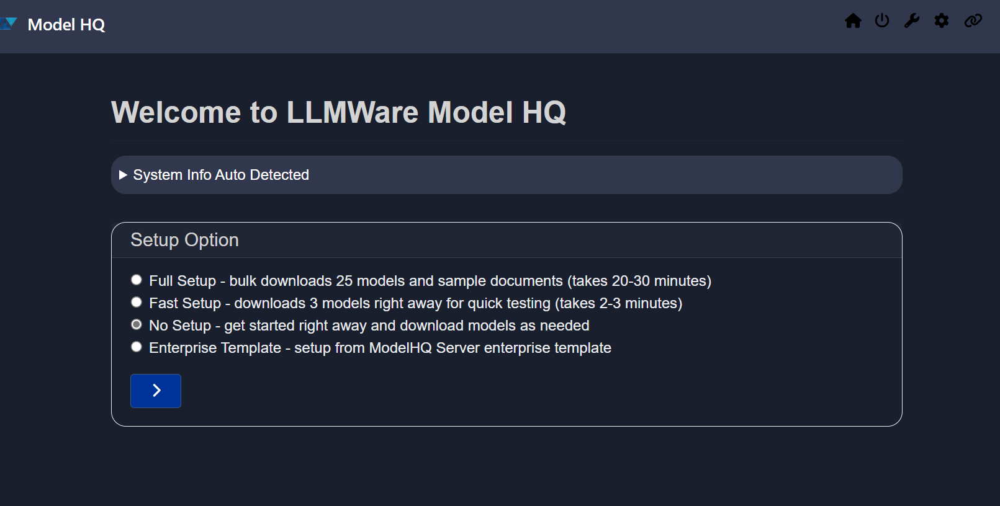
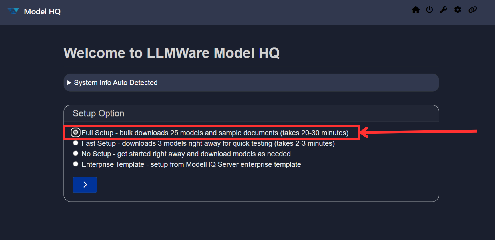
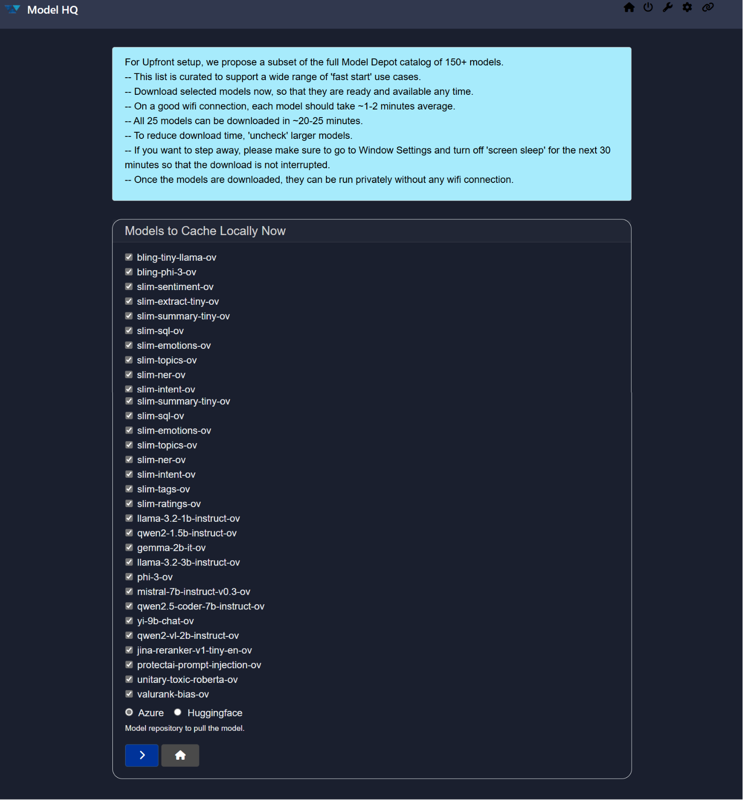
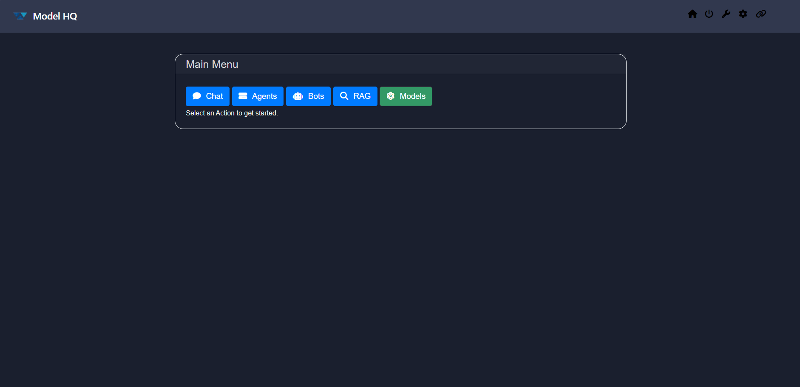
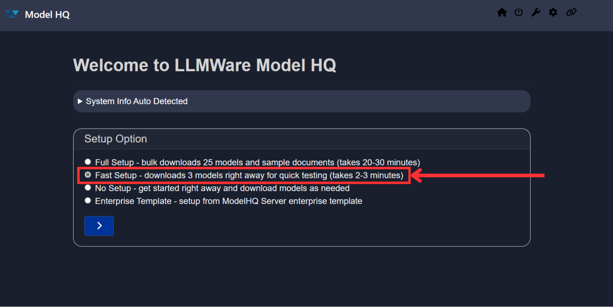
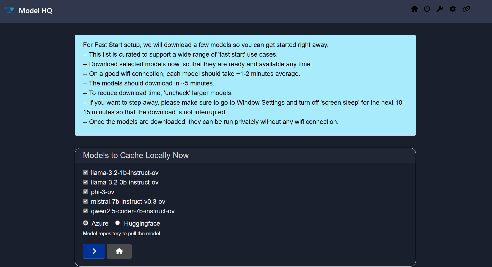
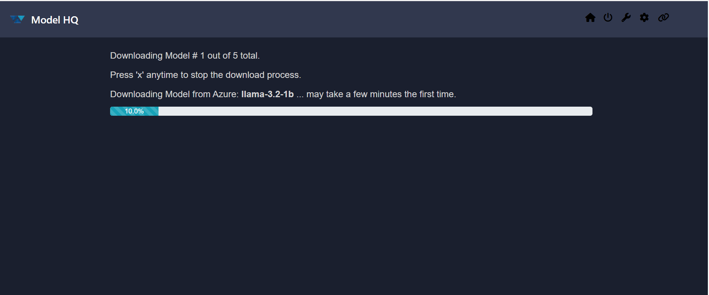
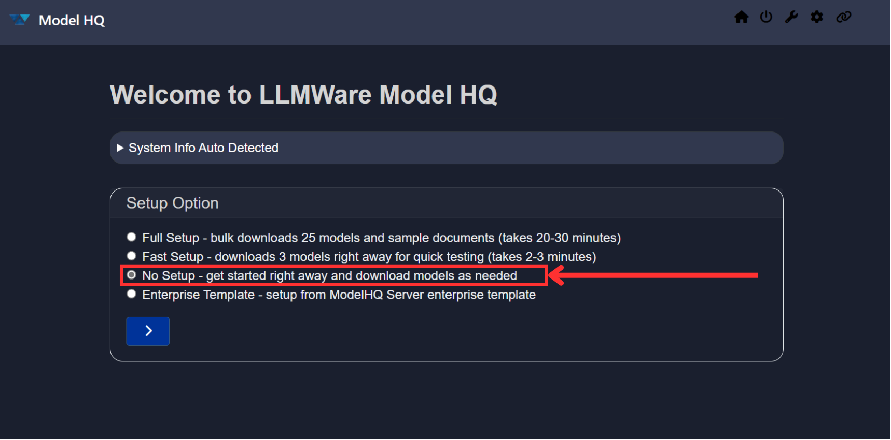
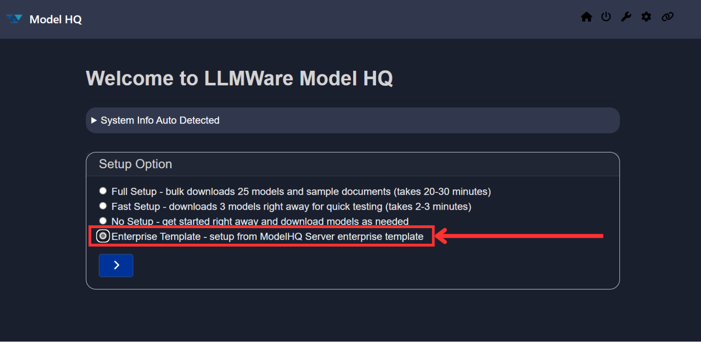

## Getting Started with Model HQ

After installing the **llmware** application on your system, launch the application. You will be presented with an interface similar to the one shown below:

The application will automatically detect your system information. Click on the `System Info Auto Detected` section to expand it.  
Ensure that your system meets the [Model HQ System Requirements](https://github.com/RS-labhub/ModelHQ-Docs/tree/master/systemConfiguration/SYSTEM_CONFIGURATION.md) before proceeding.

&nbsp;

### Setup Options

Once your system compatibility is confirmed, you will be presented with the following setup options:

- **1. Full Setup**  
  This option automatically configures your environment by pre-loading 25 curated models along with a set of test cases.  
  This setup is ideal for Demo set-up and for users who want a ready-to-use environment with minimal manual configuration.  
  _Estimated setup time: ~30 minutes._

- **2. Fast Setup**  
  Quickly set up an environment with a curated selection of 3 small models to get going.  
  _Estimated setup time: ~2-3 minutes._

- **3. No Setup**  
  Customize your environment manually by selecting and configuring only the models you need. Recommended for advanced users who prefer full control over their setup. The models will be loaded as they are selected and will take time to load.

- **4. Enterprise Template**  
  Use a pre-configured enterprise-grade template designed to streamline deployment across large teams. Best suited for organizational adoption with minimal configuration overhead.

&nbsp;

## Getting Started with Full Setup
The **Full Setup** option allows you to configure Model HQ with a comprehensive environment that includes 25 of the most accurate and powerful models available. This setup is ideal for users who want to get started without any custom configuration. We recommend this for DEMOs. This set up still allows for other models to be added when selected.  
This documentation outlines what the Full Setup process includes and how to get started.

1. On the setup options screen, select the `Full Setup` option and click the `>` button to proceed.  
   

2. To use this option, it is important that you configure your laptop or PC setting as shown in the [Set-Up Guide], so that you adjust the screen, sleep and hibernate time-outs to at least 2 hours so that screen timeouts do not interrupt the initial model download.
    
3. You will be presented with a screen displaying the list of models that will be downloaded as part of the setup.  
   Review the list, and optionally deselect any models you do not wish to include to reduce setup time.  
   Once satisfied with the selection, click `>` to begin the download process. (it will typically takes ~30 minutes if you download all the listed models, depending on your Wi-Fi speed)  
   Choose the source for model downloads — either **Azure** (recommended) or **Hugging Face**. Once ready, click `>`.
   

4. After the setup completes, you will be directed to the **Main Menu** of Model HQ, where you can begin using your fully configured environment.  
   

&nbsp;

## Getting Started with Fast Setup
Looking to explore Model HQ with minimal setup time? The **Fast Setup** option is designed for a quick start experience.  
It loads a set of lightweight models (approximately 1 billion parameters each or similar) and sets up your environment in just a few minutes.  
This setup is ideal for initial testing and quick evaluation of Model HQ. You will still be able to manually download models in the product as needed.

1. On the setup options screen, select the `Fast Setup` option and click the `>` button to proceed.  
   

2. You will now see a list of small models (around 5) available for download.  
   You can deselect models to minimize the download time.  
   Choose the source for model downloads — either **Azure** (recommended) or **Hugging Face**. Once ready, click `>`.  
   

3. The selected models will begin downloading.  
   Typical download time: ~1–2 minutes per model.
   Please do not close the screen during this process.  
   

4. Once the setup is complete, you will be directed to the **Main Menu** of Model HQ where you can begin working with your environment.  
   

&nbsp;

## Getting Started with No Setup
Looking to configure **Model HQ** your way? The **No Setup** option provides complete flexibility to customize your environment and workflows where you will manually download each model as selected. This documentation will guide you through each step and help you explore all available features.

1. In the setup options screen, select the `No Setup` option and click on the `>` button to proceed.  
   

2. You will be directed to the **Main Menu** interface of Model HQ, as shown below.  
   This is the central workspace where you can manually load models, configure settings, and fully customize your Model HQ environment.  
   

&nbsp;

## Getting Started with Enterprise Template
The **Enterprise Template** is a fully pre-configured setup tailored specifically for enterprise needs, and enables a standard configuration for all users, including a common set of custom Bots, Agents and other configurations.

If you have received an Enterprise Template from your IT or development team, you can launch the Model HQ application by selecting this option. You will then be prompted to upload the template zip file.  Once you upload the template zip file, the configuration template will be installed, and you will all set and ready to get started!

1. On the setup options screen, select the `Enterprise Template` option and click the `>` button to proceed.  
   

n. Once the setup is complete, you will be directed to the **Main Menu** of Model HQ, where you can begin working with your environment.  
   
