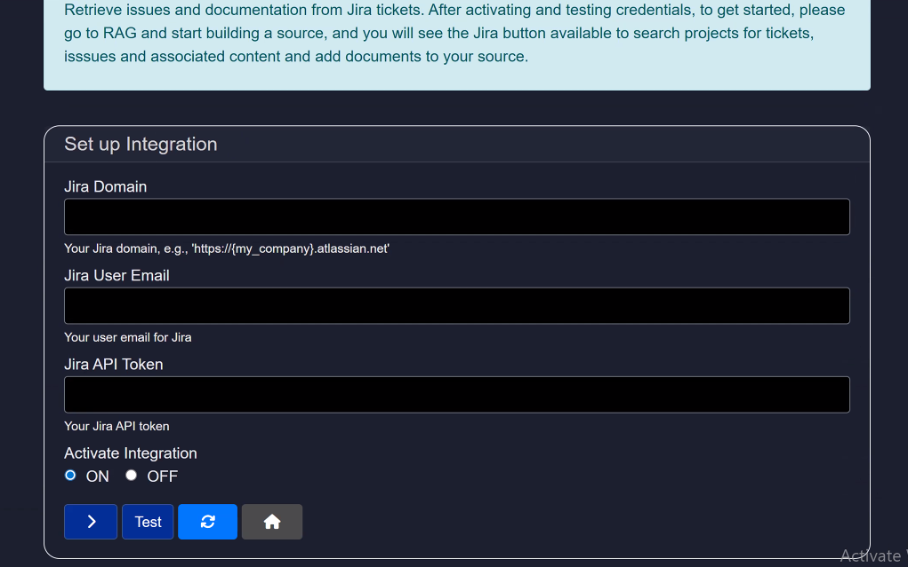

## Exploring `Integrations` in Model HQ
How to view, add, and test third-party integrations in Model HQ. It is intended for administrators and users responsible for configuring external services.

The guide lists available integrations, provides step-by-step instructions for adding and testing credentials, and outlines security and troubleshooting guidance.

### Supported integrations
Model HQ provides connectors for a variety of services. Current integrations include:

- Model HQ Agent Server
- AWS S3 Bucket
- Azure Blob Storage
- Serp API Search
- Tavily Search
- NewsAPI.org
- Finnhub
- Jira API
- ServiceNow
- Zendesk
- Gmail
- Wikipedia
- Yahoo Finance
- OpenAI
- Anthropic Claude
- Google Gemini
- Windows Local Foundry

Additional integrations are planned. To request a connector, contact support@aibloks.com.

### Managing integrations
To configure integrations, open the Integrations section in the main menu and use the Manage Integrations interface to add or update credentials.

1. Open Integrations from the main menu.
   

2. The Integrations view contains three sections: **Manage Integrations**, **Credentials Handling**, and **Active Integrations**. Use Manage Integrations to add or modify connectors, Credentials Handling to review stored credentials, and Active Integrations to see currently enabled connectors.
   

3. To add a connector, select the desired tool from the dropdown and click the **Next** button (`>`). For example, select Jira and click **Next**.
   

4. Enter the required credentials for the selected connector. Model HQ stores credentials securely; credentials are not transmitted externally during entry unless you enable a connector that requires external access.
   

   - To defer activation, select **No** for the activation option.
   - Click **Next** (`>`) to save the credential entry.

5. After successful entry, the connector will be added to your account.
   

### Testing an integration
1. Select the integration from the dropdown.
2. Click the **Test** button to verify connectivity and credentials.
   

If the test succeeds, the integration is active. If it fails, review the error message and verify credentials and network settings.

### Security and data handling
- No data is leaving your app.
- Credentials are stored locally in your Model HQ app.
- Model HQ does not share credentials with third parties without explicit consent. When enabling integrations that require external access, follow your organization’s security policy.
- For sensitive systems (financial, production data, support systems), consult your security team before enabling access.

### Troubleshooting
- Verify that API keys, tokens, and URLs match the values provided by the service.
- Confirm network connectivity and any required firewall or allowlist configuration.
- Review logs or the Test operation error messages for diagnostic information.

### Conclusion
Model HQ integrations enable connections to external data sources and services in a secure, auditable way. Use the Manage Integrations and Credentials Handling interfaces to add, verify, and administer connectors.

If you have any questions or feedback, please reach out to us at `support@aibloks.com`.