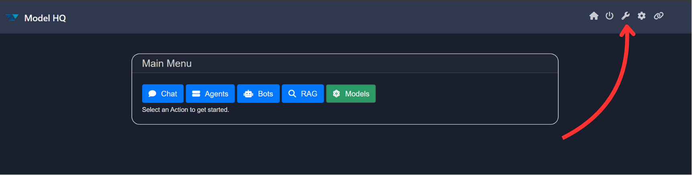
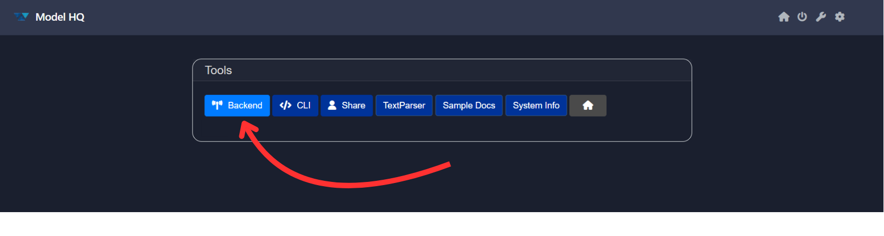
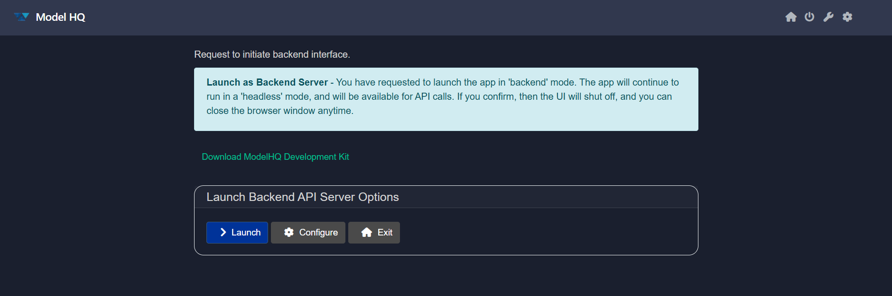
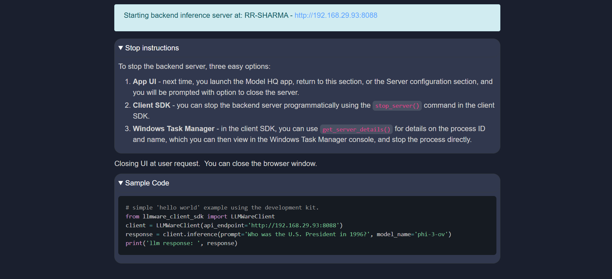
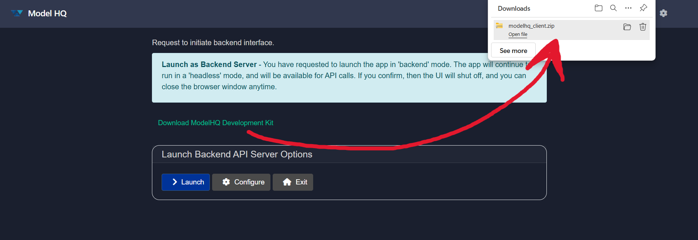
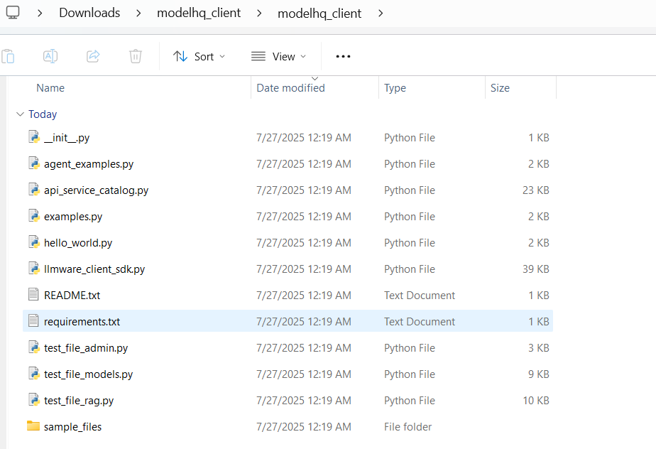
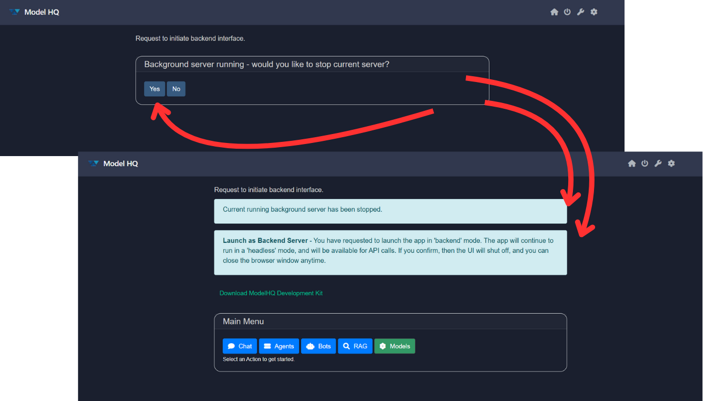

# Getting Started with Code on Model HQ
This guide walks you through the initial steps to launch and configure the backend inference server in **Model HQ**, enabling seamless programmatic access to over 40+ APIs through the Model HQ SDK.

&nbsp;

## 1. Launching the Tools Interface

To begin, navigate to the main menu at the top-right corner of the interface and click on the **Tools** button (🔧).



The tools page should look like this:


&nbsp;

## 2. Launching the Backend Server

Select the **`Backend`** option from the tools interface. This initiates the backend API server in a headless mode, shutting down the user interface and enabling direct access via APIs.

This is ideal for lightweight, modular deployment scenarios. Once launched, the server runs as a background service and can be accessed either via `localhost` or over an external IP address—enabling private, local inference workflows.

You will be provided with a download link for the **Model HQ SDK**, which contains all the necessary libraries, sample code, and examples to get started. Simply unzip the SDK package, open your preferred IDE, and start coding with direct access to the backend APIs.



The backend interface includes two main options:

* **Launch**: Starts the backend server immediately.
* **Configure**: Opens the configuration settings before starting the server.

&nbsp;

## Launch Backend Inference Server Guide



### Starting the Server

To start the backend inference server, simply click **Launch** or use the CLI tools provided in the SDK. Once launched, the server is accessible at:

```
Server URL: http://192.168.29.93:8088
```

&nbsp;

### Stopping the Server

You can stop the backend server using any of the following methods:

1. **From the Model HQ UI**

   * Open the Model HQ application.
   * Navigate to **Server Configuration**.
   * Use the provided control to shut down the server gracefully.

2. **Using the Client SDK**

   * Invoke the `stop_server()` method from the SDK to terminate the server programmatically.

3. **Via Windows Task Manager**

   * Use the SDK’s `get_server_details()` to retrieve the process ID.
   * Open Task Manager and manually stop the corresponding process.

&nbsp;

### Sample Code: Hello World

Below is a basic example demonstrating how to make an inference call to the backend server using the SDK:

```python
# simple 'hello world' example using the development kit.
from llmware_client_sdk import LLMWareClient
client = LLMWareClient(api_endpoint='http://192.168.29.93:8088')
response = client.inference(prompt='Who was the U.S. President in 1996?', model_name='phi-3-ov')
print('llm response: ', response)
```

&nbsp;

## Configure or Configure Backend API Sever for 'Headless' Mode


Before launching the backend in headless mode, you may choose to configure the server using the **Configure** option. Below are the available settings:

### Host Type

* **Localhost**: Restricts access to the local machine only.
* **External IP**: Allows access from other devices on the network.

### IP Address

* **Default**: `127.0.0.1`
* **Example**: `192.168.29.93`

### Port

* **Default**: `8088`
* This can be modified as needed to avoid port conflicts.

### Worker Threads

* **Default**: `4`
* Recommended for lightweight concurrency; adjust only if needed for performance tuning.

### Trusted Key (Optional)

* **Enable Key Requirement**: All API calls must include a trusted key.
* **No Key Required**: Skip key-based authentication.


Save your changes by clicking on `>` button.

&nbsp;

## Downloading the Model HQ SDK



Clicking on the **Download Model HQ Development Kit** button will download a `.zip` file. Once extracted, it will contain the following files:



```
├── __init__.py
├── agent_examples.py
├── api_service_catalog.py
├── examples.py
├── hello_world.py
├── llmware_client_sdk.py
├── README.txt
├── requirements.txt
├── test_file_admin.py
├── test_file_models.py
├── test_file_rag.py
```

Each script serves a different purpose—from demonstrating API usage to running test cases. Refer to `README.txt` for detailed usage instructions.

&nbsp;

## Closing Backend Server
- Close the Model HQ UI.
- Open the Model HQ again.
- Go to tools > backend.
- You will be asked to "Would you like to stop current server?". Click on `Yes`.



&nbsp;

## Conclusion
You’re now ready to begin building applications using the Model HQ backend inference server. For more advanced topics, refer to the [API Reference Guide](https://model-hq-docs.vercel.app/api-reference) and the [Inside Model HQ SDK](#).

If you have any questions or feedback, please contact us at `support@aibloks.com`.
