## Exploring `Models` in Model HQ
Once the initial setup is complete, you will be directed to the **Main Menu**.  
This interface provides access to various features. In this section, we will focus exclusively on the **Models** functionality.

The **Models** section allows you to explore, manage, and test models within Model HQ. You can discover new models, manage downloaded models, review inference history, and run benchmark tests — all from a single interface.

&nbsp;

### 1. Launching the Models Interface
To begin, click on the **Models** button from the main menu.

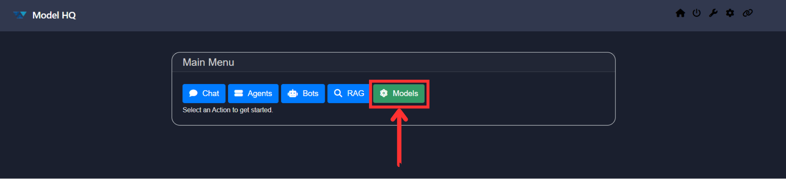

&nbsp;

### 2. Overview of the Models Interface
After launching the Models section, you will be presented with an interface similar to the one shown below:

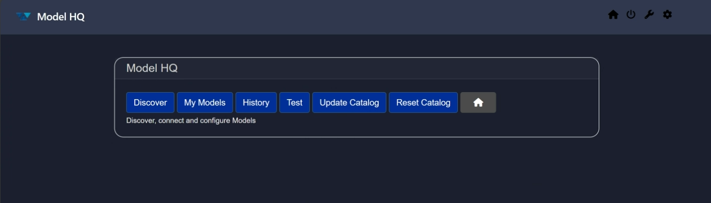

The interface includes the following key options:

1. **Discover**  
   Explore new Chat, RAG, or Function-calling models available in the catalog.

2. **My Models**  
   Manage your downloaded models — test, troubleshoot, or remove them.

3. **History**  
   Review a historical log of your model inference transactions.

4. **Test**  
   Run standardized test cases on any selected model.

5. **Update Catalog**  
   Pull the latest version of the model catalog.

6. **Reset Catalog**  
   Reset the current catalog to fetch new or updated models.

7. **Home**  
   Return to the main menu.

&nbsp;

### 3. Discover
The **Discover** option allows you to browse and evaluate new models. You can review detailed descriptions, test models using predefined use cases, or interact with them through the chat interface.

Upon selecting **Discover**, you will be prompted to choose a model category:

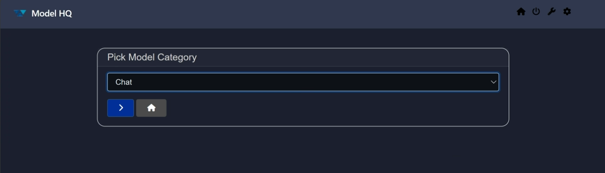

The available categories include:
- Chat
- RAG
- Function-Calling

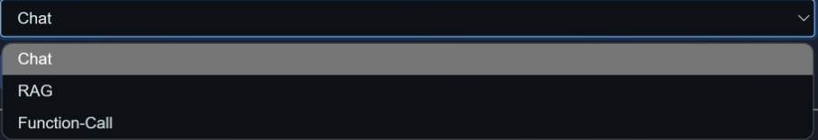

Select the category you’re interested in, and click `>` to proceed. A list of models relevant to that category will appear:

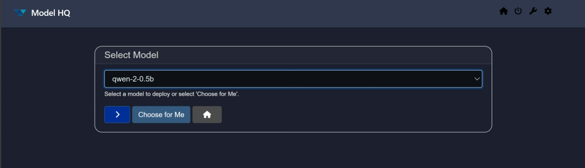

For demonstration purposes, we’ll proceed with the default model, `qwen--0.5B`. Click `>` again to continue.

> [!TIP]  
> Not sure which model to choose? Click **Choose for me** to let the system select one for you.

You will then be taken to the detailed page with model description and the model card contact:

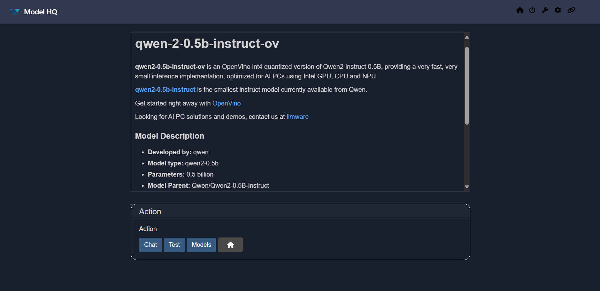

Here you can:
- View a full description of the selected model
- Choose from three actions:
  - **Chat**: This selection with take you to the chat interface for this model. Navigate to the [Chat Interface](https://github.com/RS-labhub/ModelHQ-Docs/blob/master/chat/CHAT.md#4-understanding-the-chat-interface)
  - **Test**: Evaluate the model using predefined performance bench mark test. You can view the context passage that is passed to the model by selecting the Context Passage window, and compare the LLM response versus the Gold Answer (i.e., the correct answer). Additionally, the performance test shows other relevant metrics such as input and output tokens, total processing time for the response and first token speed.
    
    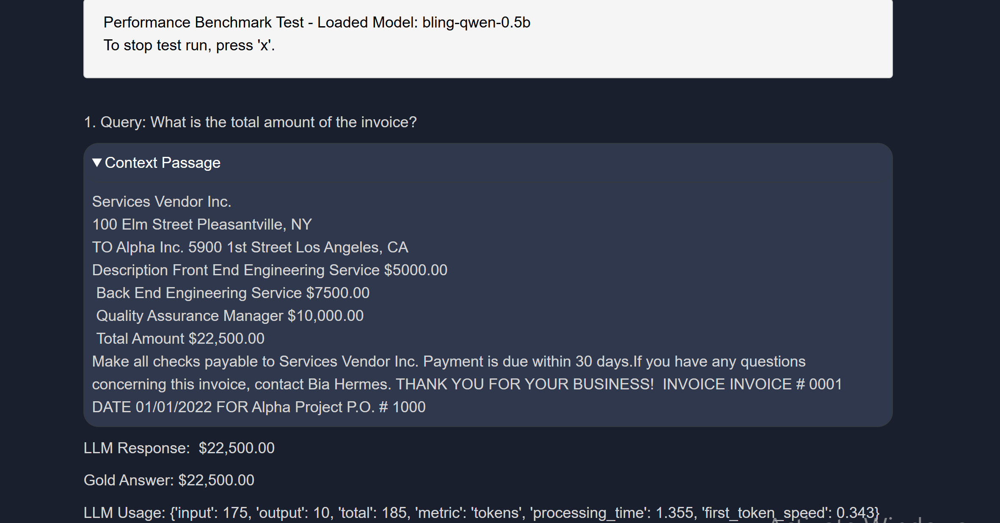
    Optionally, download the results for offline review. You can terminate the process anytime by pressing "x" key.
  - **Models**: Return to the model discovery menu

&nbsp;

### 4. My Models
The **My Models** section lists all locally downloaded models along with their disk usage.

You will be prompted to select a model from your local list:

Click `> Select` to proceed. The interface will now display information about the selected model and offer several actions:

- **Chat**: Access the [Chat Interface](https://github.com/RS-labhub/ModelHQ-Docs/blob/master/chat/CHAT.md#4-understanding-the-chat-interface)
- **Test**: Run benchmark tests with predefined use cases
- **Troubleshoot**: Resolve issues such as incomplete downloads  
  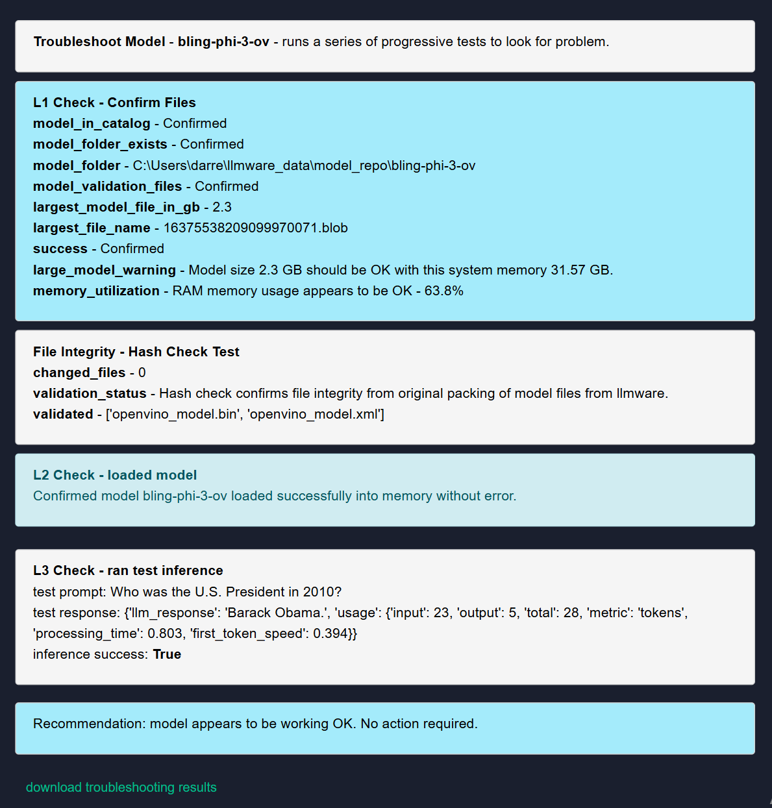  
  If any issues are detected, you can:
  - **Confirm**: Download troubleshooting logs
  - **Delete**: Remove the log file
  - **Repair**: Reinstall the model
  - **No action**: Return to the main menu
- **Delete**: Remove the model from local storage

&nbsp;

### 5. History
The **History** section provides a tabular record of your inference activity. You can also download the history for analysis or auditing purposes. To activate History, the user must first select Configuration Icon (⚙️) in top right hand corner, `controls`, then select **Save** for "Save all inferences to local database."

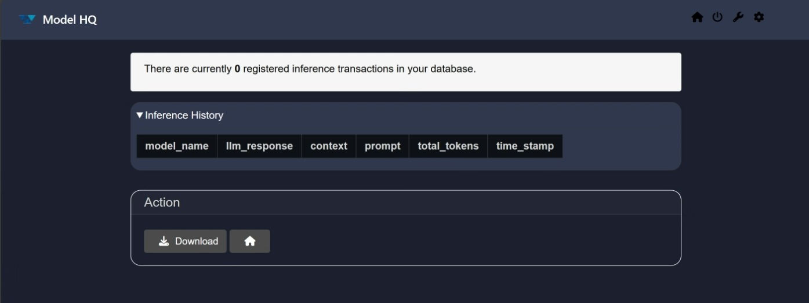

&nbsp;

### 6. Test
The **Test** functionality allows you to benchmark any available model using predefined scenarios. This is helpful for comparing model performance across different use cases.

Results can be downloaded and reviewed to assist in model selection.

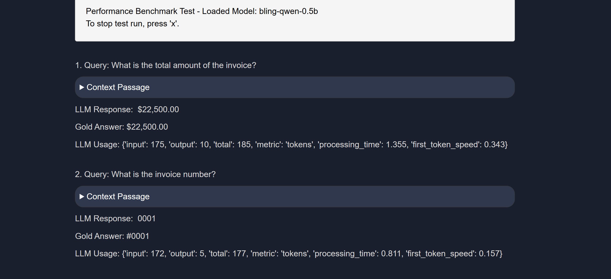

&nbsp;

### 7. Update Catalog
Use **Update Catalog** to fetch the latest available models. Previous versions of the catalog are maintained for reference. You can choose to pull any version, preferably the latest one.

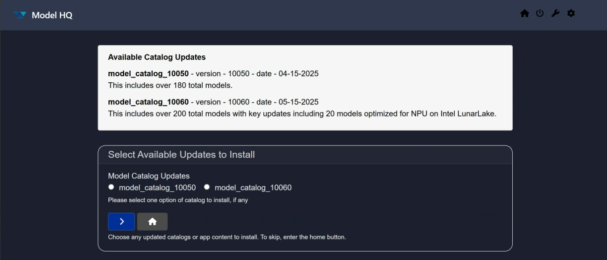

&nbsp;

### 8. Reset Catalog
If needed, you can reset your existing catalog using this option. Once reset, you can then fetch a fresh catalog from the **Update Catalog** section.  
Note that models will not be accessible until a new catalog is pulled.

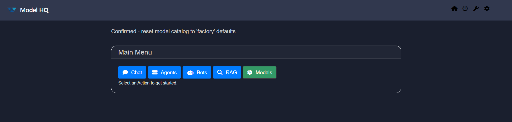

&nbsp;

### Conclusion
In this documentation, we explored the **Models** section of Model HQ. We detailed the purpose and functionality of each action available, including discovering, managing, testing, and troubleshooting models.

For further assistance or to share feedback, please contact us at `support@aibloks.com`
