## Exploring `RAG` in Model HQ
Once you complete the initial setup, you will be directed to the **Main Menu**.  
This interface provides access to several powerful features. In this section, we will focus on the **RAG** feature, which stands for **Retrieval-Augmented Generation**.  

RAG combines retrieval-based techniques with generative AI to allow models to answer questions more accurately by retrieving relevant information from external sources or documents. With RAG in Model HQ, you can create knowledge bases that you can query in the chat section or via a custom bot by uploading documents. The RAG section is used only to create the knowledge base.

&nbsp;

### 1. Launching the RAG Interface
Click on the **RAG** button from the main menu to get started.  
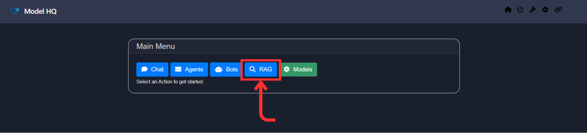

&nbsp;

### 2. Understanding the RAG Interface
You will be presented with an interface similar to the one shown below:  
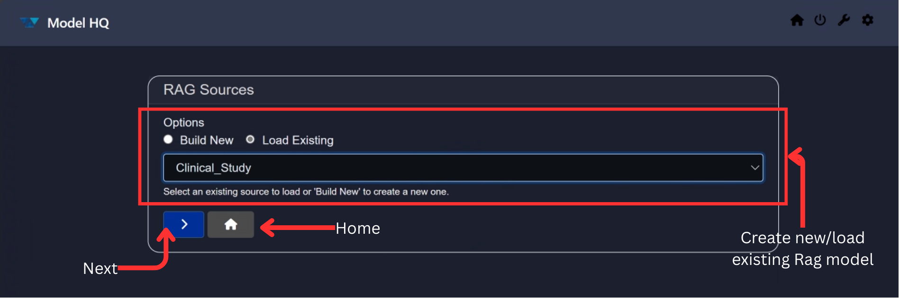

Key elements of the interface:

- **RAG Sources Options**
  - **Build New**: Create a new RAG source using the available template.
  - **Load Existing**: Load previously created RAG sources.

- **Dropdown**: Displays the list of existing RAG sources.

- **Next ( `>` ) Button**: Proceeds to the next step.

- **Home**: Returns you to the main menu.

&nbsp;

### 3. Creating a New RAG Source
To create a new RAG source:

- Select **Build New** from the RAG interface.

You’ll be prompted to enter a name and select an **Analysis Mode**:  
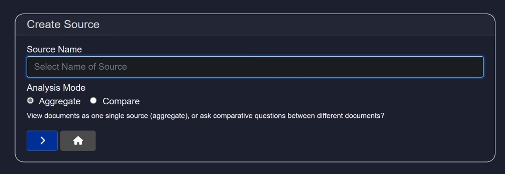

- **Aggregate**: Treat all uploaded documents as a single unit.
- **Compare**: Enables comparative questions between documents.

Click the `>` button to proceed.

Once created, you’ll be directed to a screen where you can add documents, [similar to this](https://github.com/RS-labhub/ModelHQ-Docs/blob/master/rag/RAG.md#add-docs-button):  
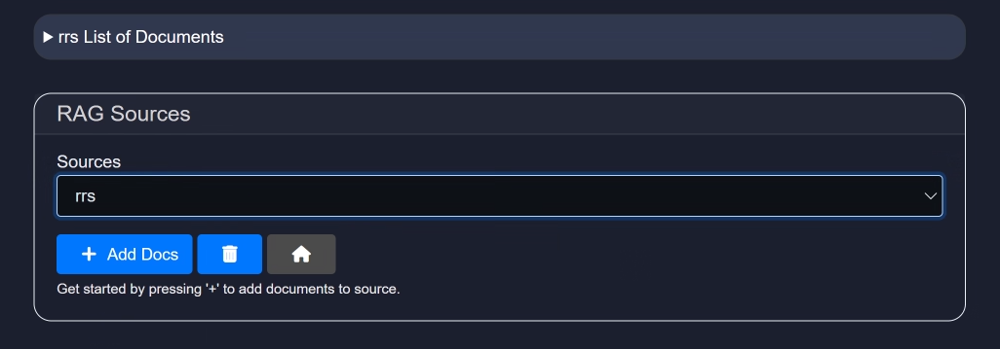

Once the initial group of files are uploaded, you can add more files to the source by selecting `+ Add Docs'. You are also able to add sources from Wikipedia to the Rag source by selecting `Wikipedia` and typing in the retrieval topic. This feature also allows you to add the number of articles you select (up to 10) from Wikipedia that may be pertinent to your topic.


After uploading, you’ll gain access to all features in the RAG section [load existing section](https://github.com/RS-labhub/ModelHQ-Docs/blob/master/rag/RAG.md#3-loading-an-existing-rag-source):  
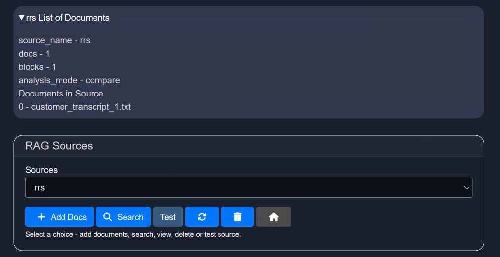

&nbsp;


### 4. Loading an Existing RAG Source
To load an existing RAG source, select the `load existing` option and click `>`, and then:

1. Select a RAG source from the dropdown list.  
2. Click the `>` button to proceed.

In the example below, the RAG source **"Clinical_Study"** is selected:  
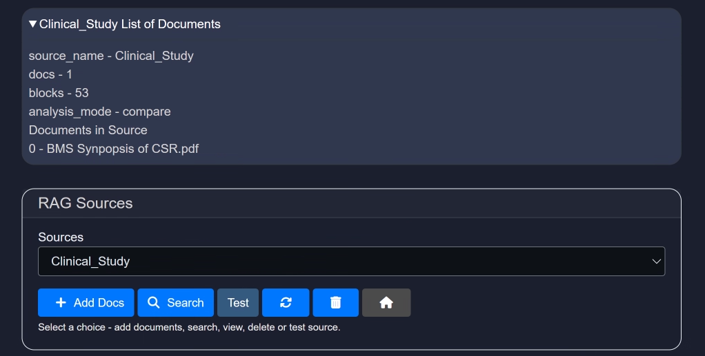

Once the source is loaded, you will enter the RAG workspace.  
This interface provides detailed information about the selected RAG source and offers several powerful tools and options.

&nbsp;

#### `Add Docs` Button
Use this button to add additional documents to your RAG source.  
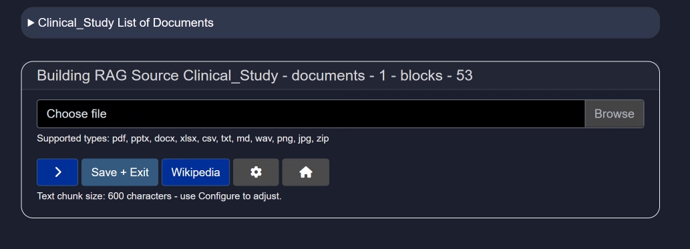

Click **Upload File** to import documents. Recommended file types include `.pdf`, `.pptx`, `.docx`, `.xlsx`, `.csv`, `.txt`, `.md`, `.wav`, `.png`, `.jpg`, and `.zip`.

If you do not have a document on hand, you can use the **Wikipedia** button to import data directly from Wikipedia.

**Additional controls:**
- `>` – Add multiple documents sequentially.
- **Save + Exit** – Save your uploaded documents and return to the main interface.
- **Wikipedia** – Add Wikipedia as a knowledge source instead of uploading files.
- **Configure (⚙️)** – Configure parsing settings such as **text chunk size**.
  > [!TIP]  
  > Text chunk size determines how the document is segmented into smaller pieces during parsing. Choosing the right size is important—too small may lose context, while too large could reduce processing performance or exceed model input limits.  
  > 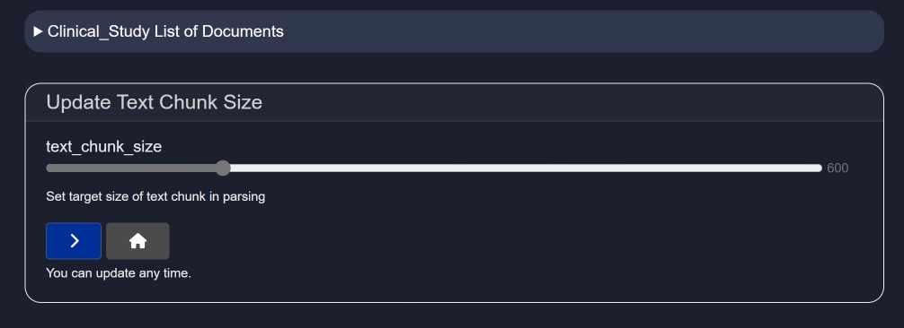

#### `Search` Button
The **Search** feature is a core component of the RAG interface, enabling users to query content within documents efficiently and effectively.  
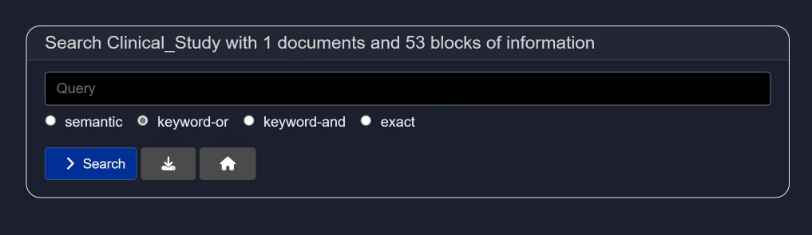

Unlike basic search tools, the RAG-powered search is augmented with semantic understanding. This allows you to:
- Ask questions naturally (e.g., “What are the key findings of the clinical study?”)
- Retrieve precise and relevant answers from uploaded content
- Navigate large volumes of unstructured data quickly

Add your query in the query field and then select any of the below options:
- Semantic
  - Semantic search is a search technique that aims to improve search accuracy by understanding the meaning (semantics) behind the words in a query, rather than just matching exact keywords.

- keyword-or
  - Finds results that contain any of the keywords.
  - Logic used: OR logic.
  - Example:
  ```
  Search: dog OR cat
  → Returns results with either "dog", "cat", or both.
  ```

- keyword-and
  - Finds results that contain all of the keywords.
  - Logic used: AND logic.
  - Example:
  ```
  Search: dog AND cat
  → Returns results that contain both "dog" and "cat".
  ```

- exact
  Finds results that contain the exact phrase in the same order.
  - Example:
  ```
  Search: "artificial intelligence"
  → Only returns results with the full phrase "artificial intelligence", not just "artificial" or "intelligence" separately.
  ```

| Type            | Matches                                                             | Example Query                  |
|-----------------|---------------------------------------------------------------------|--------------------------------|
| Semantic Search | Related meanings or concepts, even if exact words are not present  | `benefits of eating apples` → matches “health advantages of apples” |
| Keyword-OR      | Any of the words                                                    | `apple OR orange`              |
| Keyword-AND     | All the words                                                       | `apple AND orange`             |
| Exact Search    | Exact phrase (in the same order)                                    | `"apple orange juice"`         |

#### `Test` Button
The **Test** button allows you to evaluate your RAG setup by running prompt-based queries against it using different AI models.  
This is an essential step to ensure that your RAG source responds accurately and effectively to real-world questions.

You can enter sample questions and review how different models interpret and respond to your document content. Based on the responses, you can choose the model that delivers the most accurate or relevant results.

> For demonstration purposes, we will use the default model and default settings.

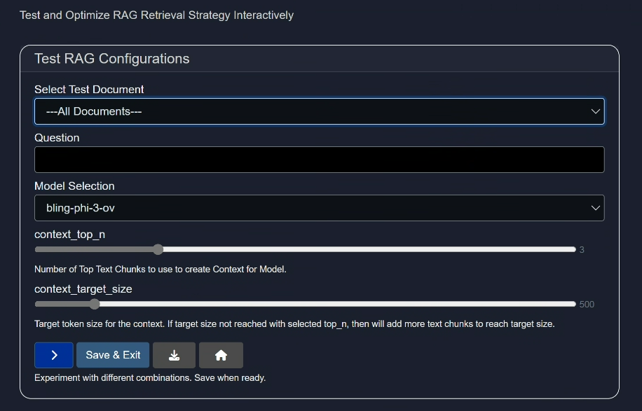

- Select Test Document:
  Either choose all the documents or select any one you have uploaded (via "add-docs" button) for testing purpose.

- Question:
  Ask a question related the the document to test the model.

- Model Selection:
  Select a model as per your need or select random models to test them.

- context_top_n:
  Increase or decrease the number of top text chunks use to create context for model.

  > [!TIP]
  > Context Top N refers to selecting the top N most relevant pieces of information (e.g., text chunks) from a larger context based on similarity to a query, and it's important because it ensures the model focuses on the most pertinent data to generate accurate and relevant responses. Choosing this will give you the number of results you indicate which is particularly important if you selected the "Compare" feature for the source, and would like to see individual results.
  >
  > Example: We uploaded 8 individual employment agreements in our source, and selected "context_top_n" as 8 so that we can get the answers for all 8 agreements about their base salaries in each of these agreements.
  >
  > [ROHAN - insert screenshot]

- context_target_size
  Select the target token size for the context. If target size not reached with selected top_n, then will add more text chunks to reach target size.

  > [!TIP]
  > Context target size is the predefined maximum amount of text (in tokens) that can be included in a model’s input, and it balances the trade-off between including enough relevant information and staying within the model’s processing limits to ensure efficient and coherent responses.

- Action buttons
  - `>` button: Runs the test query and throw the output
  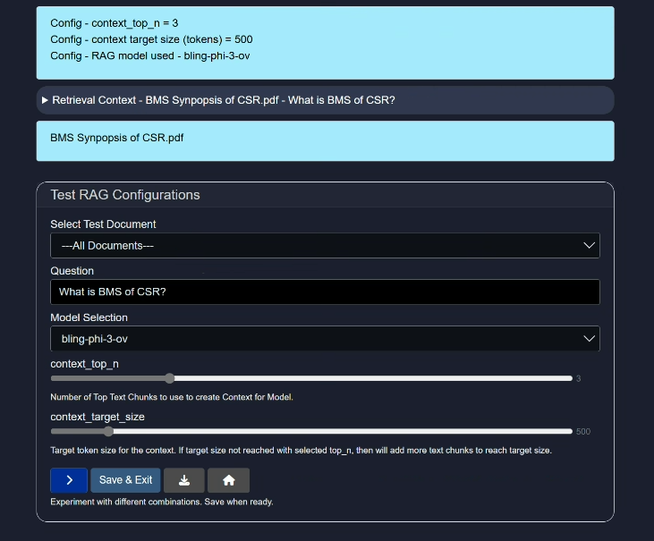

  - Save + Exit button: Save the currrent settings and exit the Test button interface.

  - Download button: Download the results of the run test cases so that you can use this information to compare results against other test runs using different models, queries and configurations.

  - Home button: Takes you back to the home page.

#### `Reset` Button (🔄)
Resets any modifications made to the current RAG source.


#### `Delete` Button (🗑️)
Deletes the selected RAG source entirely from your workspace.

&nbsp;


### Conclusion
In this documentation, we explored the **RAG** source-building functionality in Model HQ.  
We covered how to create new and load existing RAG sources, and utilize tools like document upload, semantic search, testing, and configuration settings.

If you have any questions or feedback, please contact us at `support@aibloks.com`.
