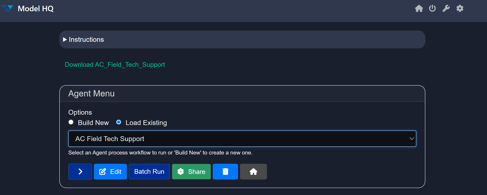
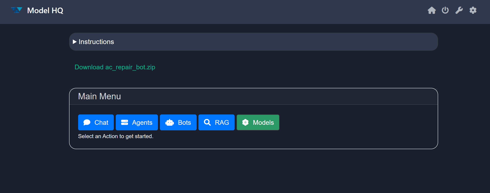

# Sharing Agents and Chatbots with Others

To share an **Agent process** or **Chatbot** you created with a friend or colleague who also uses **Model HQ**, it’s simple, just email them the downloaded ZIP file.

&nbsp;

## Sharing Agent Processes

### To share an Agent process:

1. Go to the **Agents** tab.
2. Scroll to the name of the Agent process you want to share.
3. Click the **❃ Share** button.
4. You will see a download link:
   `"Download [Agent Process Name]"`
5. Email the downloaded `.zip` file to the recipient, along with any necessary instructions.

&nbsp;

### To upload and use a shared Agent process:

1. Download the `.zip` file sent by your colleague.
2. Go to **Agents**, then click **Build New** > **Upload**.
3. Upload the ZIP file containing the Agent process.
4. After uploading, go back to **Agents** from **Home**, and you'll see the new workflow listed.

&nbsp;

## Sharing Chatbots

### To share a custom Bot:

1. Go to the **Bots** section.
2. Scroll to the bot you wish to share.
3. Click the **❃ Share** button.
4. You will see a download link:
   `"Download [Custom Bot Name]"`
5. Email this file to the recipient along with any usage instructions.

&nbsp;

### To upload and use a shared custom Bot:

1. From **Home**, go to **Bots** > **Build New** > **Upload**.
2. Upload the ZIP file containing the chatbot.
3. After uploading, go to **Home** > **Bots**.
4. You’ll find the newly shared Bot ready for use.

&nbsp;

## Conclusion

In this documentation, we explored how to **share Agent processes and custom Chatbots** within Model HQ.
We covered how to download and send your Agent or Bot to others, as well as how to upload and use shared ZIP files for seamless collaboration.

If you have any questions or feedback, please contact us at `support@aibloks.com`.
