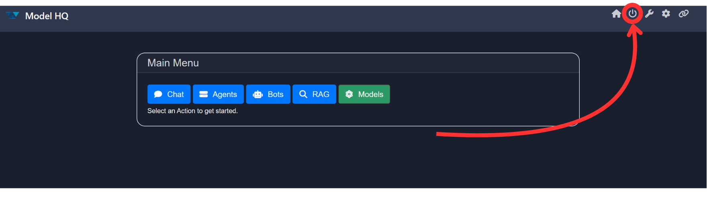

# Shutting Down Model HQ

To ensure optimal performance and prevent background processes, it's important to **properly shut down Model HQ after each use**.

## How to Shut Down

Click the **power button (`⌽`)** located at the **top-right corner** of the app interface.

## Why It Matters

* If the app is **not closed properly**, it may:

  * Continue running in the **background**
  * **Replicate itself** while the device is in **hibernation**
  * Cause **unintended system behavior** or **resource usage**

> [!TIP]
> Always shut down Model HQ manually to maintain system stability and avoid unnecessary background activity.

