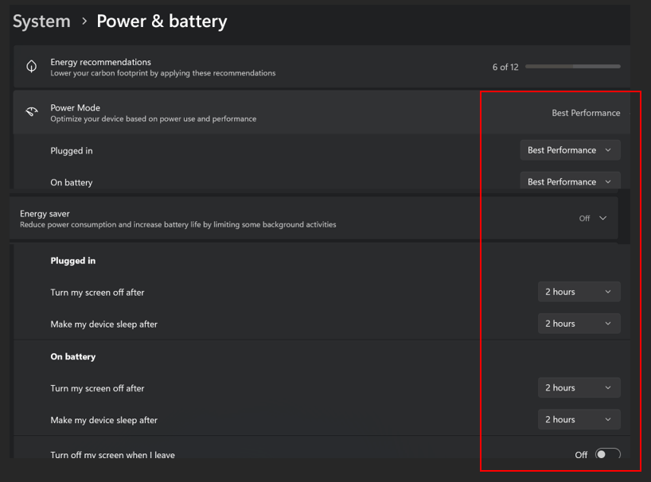

## System Configuration

### Laptop Configuration
If you are using a PC or a Laptop for Model HQ, prior to downloading the app, please check the system configuration on your machine. It is critical to have these selections prior to getting started for optimized downloading of models on your device.

&nbsp;

## Technical Datasheet

| **Category**                    | **Details**                                                                                                                                   |
|-------------------------------|-----------------------------------------------------------------------------------------------------------------------------------------------|
| **Processors Supported\***     | x86_64: CPU, GPU, NPU    ARM64: CPU, NPU                                                                                                   |
| **System Requirements**        | 16 GB RAM minimum                                                                                                                             |
| **Supported Device**           | Runs best with latest Intel AI PC devices – (i.e., Meteor Lake, Lunar Lake and Arrow Lake) and Xeon                                          |
| **Inferencing Technologies**   | OpenVINO, ONNX, GGUF, QNN                                                                                                                     |
| **Operating Systems Supported**| Windows, Linux                                                                                                                                |
| **API and Data Center Connectivity** | Supports secure, low-latency API connections to on-premise and cloud data centers for real-time data access, model deployment, and orchestration. |
| **Models Supported**           | DeepSeek, Qwen, LLaMA, Mistral, Yi, Phi, StableLM, Falcon, TinyLLaMA, Gemma, Pythia, RedPajama, BERT, RoBERTa, LLMWare SLIM, BLING and DRAGON models |
| **Model Types**                | Generative, Embedding, Rerankers, Classifiers, Image to Text (Vision), Text to SQL, Function-Calling and Enterprise custom models            |
| **Databases Supported**        | PostgreSQL, MongoDB, SQLite                                                                                                                   |
| **Vector DBs**                 | Milvus, Qdrant, Chroma, FAISS, LanceDB, Redis, PGVector, Neo4j                                                                               |

\* Execution requires Model HQ-specific Processor version to be installed.

### Technical Support
Technical support services can be requested by email: `support@aibloks.com`. Send us a message and we will respond to you as quickly as we can.

### Questions and Feedback
Go to **https://llmware.ai/contact-us** and send us a message!
AI Bloks LLC dba LLMWare.ai may make changes to specifications and product descriptions at any time, without notice.
