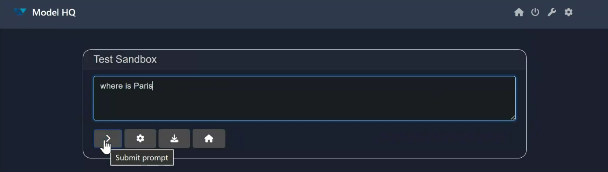
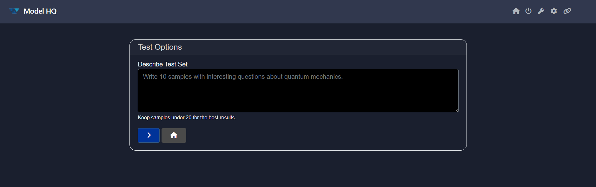

# Testing Models in Model HQ

This guide explains how to test models within **Model HQ**. You will learn how to launch the testing interface, select a model, configure test options, and use additional features such as mapping and sample generation.

&nbsp;

## 1. Launching the Test Interface

1. From the **main menu**, click on **Models**.
   

2. Then, click on the **Test** button.
   

&nbsp;

## 2. Selecting a Model

After clicking **Test**, you will be prompted to select a model.


* Use the dropdown menu to view available models. They are arranged from **lower to higher parameter sizes**.
* If you are unsure which model to choose, click **Choose for me**, and Model HQ will automatically select the most suitable model based on your [system specification](https://model-hq-docs.vercel.app/system-configuration).

> [!TIP]
> For demonstration, the `llama-3.2-1b` model has been selected.

&nbsp;

## 3. Configuring Test Options

Once a model is selected, you will be taken to the **Test Options** interface.


Here, you can choose from three test types:

1. **Sandbox** – Manual testing through direct queries.
2. **Standard** – Predefined test samples provided by Model HQ.
3. **Custom** – Upload your own dataset in JSON or CSV format.

### Sandbox Testing

1. Select **Sandbox Testing** (auto-selected by default).
2. Enter a query in the provided text area.
   
3. Click **>** to run the test.
   

If the output is unexpected, please reach out to us at **[support@aibloks.com](mailto:support@aibloks.com)**.


### Standard Testing

1. Select **Standard Testing**.
   
2. Tests will run automatically using preloaded sample data in Model HQ.
   


### Custom Testing

1. Select **Custom Testing**.
   
2. Upload your dataset (JSON or CSV).
3. Click **>** to begin testing.
   

**Custom Dataset Requirements**

* **CSV**: Must include headers with columns `query`, `context`, and `answer`.

* **JSON**: Must include rows with `query`, `context`, and `answer` keys.
  Example:

  ```json
  {
    "query": "What is the capital of France?",
    "answer": "Paris",
    "context": "France is a country in Europe."
  }
  ```

* The **Mapper** tool allows you to align your dataset schema with Model HQ’s expected format.

&nbsp;

## Additional Features

### Mapper

If you are using a custom dataset, click **Mapper** to align your schema to Model HQ’s required format.

* **Required field**: `query`
* **Optional fields**: `answer`, `context`


&nbsp;

### Generate Sample

The **Generate Sample** feature allows you to automatically create test cases.



> Keep sample sets under **20 entries** for optimal results.

**Steps to Generate:**

1. Enter a prompt such as:
   *“Write 10 samples about U.S. states asking for their capitals.”*
   

2. Click **>** to generate samples in JSON format.
   

3. Once generated, download the dataset.

4. The generated samples are already mapped and ready to use.
   

5. Click **>** to begin testing with the generated dataset.

&nbsp;

## Tips & Best Practices

1. After configuring tests, click **>**.

   * If the model is not yet downloaded, it will be fetched from the Model HQ Model Catalog (requires internet).
   * If already available locally, it will load directly.
     

2. You can also **download test results** for offline review and analysis.

&nbsp;

## Conclusion

Model HQ makes it easy to test models using sandbox queries, built-in samples, or your own datasets. You can further enhance testing with mapping tools and automated sample generation.

For questions, issues, or feedback, please contact us at **support@aibloks.com**.
