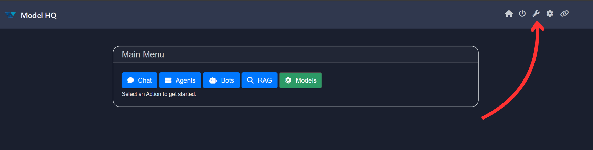
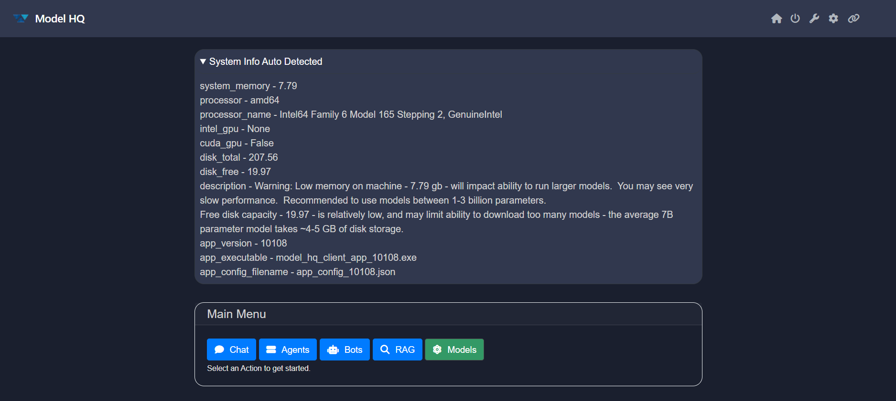

# Exploring `Tools` in Model HQ
Once the initial setup is complete, navigate to the **Main Menu**.  
Located on the top left corner of this menu, you will find the **Tools** section, denoted by the 🔧 icon.

The Tools section provides powerful utilities for managing your local setup and parsing documents. It includes system diagnostics, command-line interface (CLI) access, text parsing tools, and sample document downloads to streamline document ingestion workflows.

 

## 1. Launching the Tools Interface
To begin, click on the **Tools** button (🔧 ) from the main menu present in the top right side.


 

## 2. Overview of the Tools Interface
After launching the Tools section, the interface displays the following key options:


| Option         | Description                                                                                   |
|----------------|-----------------------------------------------------------------------------------------------|
| **Backend**     | Launches the internal API server.                                                             |
| **CLI**         | Opens a terminal window to run commands without interrupting your UI session.                |
| **Share**       | Allows sharing your session over an external IP for collaboration.                           |
| **Text Parser** | Upload documents in various formats and convert them into flattened text files using customizable chunk sizes.                   |
| **Sample Docs** | Download pre-curated document packages to test and validate your parsing and model workflows.                                |
| **System Info** | Automatically detects your system configuration, such as available memory, processor type, disk space, and GPU availability.                |
| **Home**        | Returns to the main menu.    

 

## Backend
Launches the API backend server, and turns off the UI, providing a programmatic interface to the core Model HQ platform capabilities, while running as a background service. This enables you to close the browser, while the server quietly runs in the background, providing 50+ APIs, which can be configured to be LocalHost, or exposed over external IP (for a lightweight modular inference server accessible on the network).  You can configure the backend server, and when ready, start the server.  Note: this will have the effect of closing the application and the UI will be unresponsive. You will see a download link for a SDK client package, which includes a python-based SDK with examples and samples to get quickly started. Open your IDE, create a project with the SDK, and you should be writing API calls in minutes to the backend server - all running privately and locally.


 

Example usage with llmware Python client:
```py
from llmware.web_services import LLMWareClient
client = LLMWareClient(api_endpoint="http://0.0.0.0:8088")
response = client.inference(prompt="Who was the U.S. President in 1996?", model_name="phi-3-ov")
print("llm response:", response)
```

## CLI
Selecting this option opens a separate CLI window allowing you to run commands directly.


By selecting to open the App in a command-line terminal, a second instance of the App will be created, exposed through a new terminal. You can use the CLI to start running chats, in parallel, while using the main app UI. 

To get started, once the command line interface opens, enter 'help' - and a list of options will be provided to get started.  

 

## Share
Use Share Connection to transfer your session to an external IP address. This is particularly useful for collaboration or accessing the interface from another machine. Note: this will close the localhost connection, and transfer the connection to your Model HQ app to be an externally available IP address, accessible over the network. You can then use any device to access the App, provided that it has corporate network access to that IP address.  Try with a smart phone, tablet or another PC. 


> [!WARNING]
> Sharing will stop the current session and relaunch it with a new IP configuration.

Confirm the operation by clicking on the `>` button:


 

## Text Parser
The Parse and Extract utility allows ingestion of documents in the following formats:
- `PDF`, `DOCX`, `PPTX`, `XLSX`
- `T`XT`, `CSV`, `MD`
- `WAV` (for audio parsing)
- `ZIP` (containing supported formats)

Click Upload Docs and choose your file and then click on the `>` button. All documents will be parsed into flat text chunks.


### Configure (⚙️):
Click Update Text Chunk Size to define how large each text segment should be during parsing. This impacts how text is tokenized for downstream use in models.


> [!TIP]
> Text chunk size in parsing refers to the amount of text, measured in tokens, that is processed as a single unit during analysis or transformation of the file to a searchable body of text. Selecting the right text chunk size is important because it affects how accurately and efficiently a model can understand, process, and retrieve information—too small, and context may be lost; too large, and it may exceed model limits or reduce performance.

 

## Sample Docs
This option allows you to download example document packages. These samples are useful for:

- Testing parsing pipelines
- Benchmarking extraction workflows
- Understanding document ingestion formats

Select your preferred package and it will be downloaded into your local workspace.


 

## System Info
Click on System Info to view hardware and software configurations detected by Model HQ.


This diagnostic helps assess whether your environment is suitable for downloading and running models. Please check the [System Configurations](https://github.com/RS-labhub/ModelHQ-Docs/tree/master/systemConfiguration/SYSTEM_CONFIGURATION.md)

 

## Conclusion
The **Tools** section in Model HQ is designed to provide developers with the resources they need for efficient model development and environment management.

If you have any questions or feedback, please contact us at `support@aibloks.com`.
